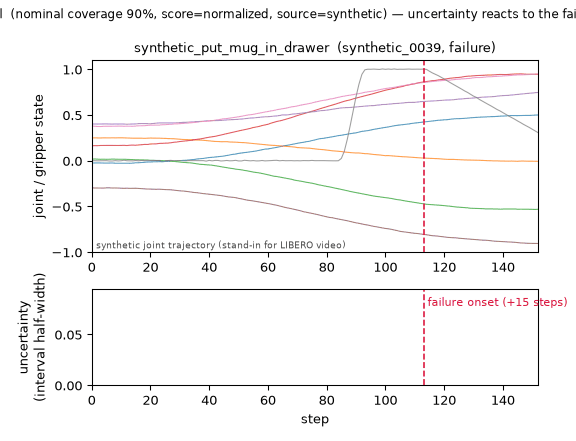

# esn-vla-uq

Closed-form, ensemble-free **calibrated prediction intervals** for VLA
(vision-language-action) policies, using an Echo State Network with a ridge read-out and
split conformal prediction.

The coverage guarantee is validated on real `openpi` rollouts. **Failure detection is
not a claim of this release** — see [Scope](#scope).

[日本語版 README](README.ja.md)

> **Every number in this repository comes from bundled *synthetic* rollout data**
> (`source: "synthetic"`). None of it is a real LIBERO evaluation result. The synthetic
> generator is deliberately tuned so that a naive baseline cannot separate success from
> failure perfectly — see [`docs/design.md`](docs/design.md) §7.

## Quickstart

```bash
uv sync
uv run esn-vla-uq calibrate     # coverage / ECE on the bundled synthetic data
uv run esn-vla-uq diagnose      # spectral radius / ESP / memory capacity
```

Four subcommands are available:

| command           | what it does                                                  |
| ----------------- | ------------------------------------------------------------- |
| `calibrate`       | conformal intervals, coverage, reliability curve, ECE         |
| `diagnose`        | reservoir diagnostics (spectral radius, ESP, memory capacity) |
| `gen-sample-data` | regenerate the bundled synthetic rollouts                     |
| `demo`            | the animation above (needs `[viz]`)                           |

`calibrate` and `demo` read a dataset via `--input`: omit it for the bundled synthetic
data, pass a `.npz` for a saved dataset, or pass a **directory** for collected openpi
rollouts. `diagnose` builds a reservoir from `ESNConfig` and needs no dataset;
`gen-sample-data` writes one.

## Working with real openpi rollouts

openpi's own eval script does not persist rollouts — it only writes replay videos — so
collection is a separate step. `scripts/collect_openpi_rollouts.py` mirrors openpi's
LIBERO eval loop and records state, action and action chunks.

```bash
# 1. openpi side: serve a policy (its own environment)
cd path/to/openpi && uv run scripts/serve_policy.py --env LIBERO

# 2. LIBERO client side (openpi's examples/libero/.venv, Python 3.8)
python path/to/esn-vla-uq/scripts/collect_openpi_rollouts.py \
    --output-dir outputs/openpi_logs --task-suite-name libero_10

# 3. back here (Python 3.12)
uv run esn-vla-uq calibrate --input outputs/openpi_logs --split within_task
```

The script is the **only** part of this repository that needs openpi or LIBERO
installed; it is not shipped in the wheel or the sdist. The package itself reads the
collected logs and depends on numpy alone.

## Demo



```bash
uv sync --extra viz
uv run esn-vla-uq demo --output outputs/demo.gif
```

The lower panel is the conformal prediction interval half-width — the per-step
uncertainty score. On the episode shown it is 1.13x higher after failure onset than
before.

**This is synthetic data, and the rise reflects how the generator was built.** The same
relationship does not hold on real openpi rollouts (see [Scope](#scope)). The demo shows
what the output looks like, not that the score predicts failure.

The rise is modest **by design**: the width is bounded to at most a 2x spread so that
it cannot be distorted by the observable's dynamic range (see below). The *ordering* of
the uncertainty score — which is what failure detection uses — is unaffected by that
bound.

> **The uncertainty reacts to the failure; it does not anticipate it.** The rise happens
> **15 steps after** onset, not before. The signal that drives it (action-chunk
> dispersion) is only refreshed at inference steps, which occur every 16 steps, so the
> lag is bounded by the chunk period. Before the failure condition starts, the chunk
> carries no evidence of it. The `demo` command prints the measured
> `detection_lag_steps` on every run.

## How it works

A rollout gives proprioceptive state, the executed action, and the policy's action
chunk. The ESN maps that history to a reservoir state; a ridge read-out predicts the
next action; split conformal turns the residuals into prediction intervals with a
finite-sample coverage guarantee. The interval half-width is the uncertainty score.

The reservoir is fixed and random — only the linear read-out is fitted, in closed form.
There is no ensemble and no gradient training, which is what makes the method a
candidate for porting onto a physical reservoir later.

## Results on the bundled synthetic data

Nominal coverage 90%, averaged over 20 calibration/test splits:

| score        | interval width  | coverage        | ECE    | mean half-width |
| ------------ | --------------- | --------------- | ------ | --------------- |
| `absolute`   | constant        | 0.8945 ± 0.0309 | 0.0134 | 0.0432          |
| `normalized` | varies per step | 0.8846 ± 0.0362 | 0.0269 | **0.0423**      |

`normalized` gives a narrower average interval and a per-step uncertainty score, so it
is the default. The coverage shortfall is smaller than one standard error of the
split-to-split spread.

## Results on real openpi rollouts

100 episodes from `libero_spatial` (10 trials per task), collected with
`scripts/collect_openpi_rollouts.py` against a live `pi0_libero` policy server:

| suite / split                  | coverage            | ECE    | mean half-width |
| ------------------------------ | ------------------- | ------ | --------------- |
| `libero_spatial` `within_task` | **0.9019 ± 0.0089** | 0.0022 | 0.195           |
| `libero_spatial` `across_task` | 0.8906 ± 0.0486     | 0.0055 | 0.237           |
| `libero_10` `within_task`      | 0.9044 ± 0.0240     | 0.0065 | 0.363           |
| `libero_10` `across_task`      | **0.7929 ± 0.1033** | 0.0797 | 0.590           |

**Coverage holds on real data across four collections.** With 10 episodes it was
0.881 ± 0.049; with 100 the spread shrank about 5x — exactly what the "effective sample
size is the number of episodes" argument predicts.

**`across_task` breaks down on long-horizon tasks**, which is what the exchangeability
argument predicts: calibration and test come from different task distributions, so the
guarantee does not transfer. On `libero_10` it drops to 0.793 with 12x the ECE. This is
why `within_task` is the default.

**Collection is not reproducible.** pi0 samples its actions (flow matching), so the same
`--seed` gives different rollouts. The `--seed` only fixes the LIBERO initial states.
Analysis of an already-collected log *is* reproducible.

## What the reservoir contributes

The read-out sees `[1, u, x]` — bias, the raw input, and the reservoir state. Since `u`
contains `action[t]` and the target is `action[t+1]`, the pass-through alone can express
the identity map. So "the intervals are narrow" is not by itself evidence that the
reservoir is doing anything. `calibrate --readout` runs the ablation
(`docs/design.md` §11):

| design matrix | what it tests         | mean half-width vs `[1, u, x]`                 |
| ------------- | --------------------- | ---------------------------------------------- |
| `[1, x]`      | drop the pass-through | **1.35–6.6x wider**, loses on 20/20 splits     |
| `[1, u]`      | drop the reservoir    | 0.56–1.12x, **direction depends on the suite** |

**Most of the work is the pass-through.** Removing it is far more damaging than removing
the reservoir.

**The reservoir's own contribution is about 10%, and its sign is not universal.** On
`libero_10` it narrows the interval by 7–11%; on `libero_spatial` it *widens* it by 17%,
and on the synthetic data by 77%. It also shrinks as the reservoir grows — largest at
N=50, nearly gone at N=500 (§11.6).

Two things follow, both of which cost us a hypothesis:

- **Reservoir diagnostics do not predict interval quality.** Sweeping spectral radius
  and leak rate over 15 settings moves memory capacity by 6.4x and the interval width by
  5%. Whether there *is* a reservoir matters 2–3x more than which one. The correlation
  even points the wrong way (more memory, wider intervals) and flips sign between task
  suites (§13).
- **`rho((1-a)I + aW)` does not summarise the dynamics.** Two settings with the same
  effective spectral radius can differ 2–3x in memory capacity, because the leak rate
  also scales the input drive — a path that does not appear in `rho(A)` (§13.5).

The one finding that transferred across suites was a hyperparameter, not a diagnostic:
a non-leaky reservoir (`leak_rate=1.0`) was the worst setting in both suites (§13.8) —
**but only at the regularisation strengths swept there.** Widen the sweep to include
`ridge_alpha=1`, and the direction of the leak-rate effect reverses (§15.3). The two
hyperparameters do not act independently; a sweep over one of them does not tell you
which way the other should go.

The defaults (`leak_rate=0.7`, `ridge_alpha=1.0`) were picked to be the least-bad
compromise across four datasets rather than the best on any one of them: no setting is
good everywhere, and even this one is 24% off the per-dataset optimum somewhere (§15).
**Treat them as a starting point, not as tuned values.**

## Scope

**What this release establishes:** prediction intervals with a finite-sample coverage
guarantee, validated on real openpi rollouts, plus reservoir diagnostics.

**What it does not:** that the uncertainty score detects failures. `calibrate` still
reports a failure-detection AUROC, but it is an exploratory diagnostic. On real openpi
rollouts it sits at chance; the high value on synthetic data (0.87) comes from the
generator having been built with that relationship in it.

This was settled with an interval, not a point estimate. Across 615 episodes with
object positions recorded, chunk dispersion gives **AUROC 0.475 [0.418, 0.533]** — the
interval excludes 0.6, the level below which a detector is not worth having. Splitting
by failure mode does not change it (`docs/design.md` §10.16).

**One thing is not excluded.** Temporal features of the reservoir's state trajectory —
autocorrelation, effective dimension, novelty — were evaluated against a pre-registered
rule (§14). Against the *moment* of failure they are flat (0.463–0.487, 0.6 excluded),
so the "uncertainty spikes just before failure" picture is not supported. But per
episode, `dropped` failures give 0.613 [0.533, 0.693] for novelty: **above chance,
straddling 0.6.** Closing that gap would take roughly 16,000 episodes, and 0.6 is the
floor of usefulness anyway — so failure detection is recorded as *undecided*, not
refuted, and is still not claimed.

Failure mode also flips the sign: trajectories collapse for failures that grasped and
then stalled, but not for failures that never grasped at all. **A detector with a fixed
sign would be wrong half the time.**

## Reservoir diagnostics

The diagnostics are a first-class output, not an afterthought — they are what makes the
reservoir's behaviour auditable before you trust any interval.

```bash
uv run esn-vla-uq diagnose --output-dir outputs/
```

```text
spectral: spectral_radius=0.900000 effective_spectral_radius=0.900000
esp: verdict=esp_holds sufficient(sigma_max<1)=False[1.784905] necessary(rho<1)=True[0.900000] ...
memory_capacity: total_mc=14.8294 mc_per_neuron=0.0741 memory_horizon=20 n_delays=200 ...
```

The echo state property is reported as **three indicators plus a verdict**, never a
single number: a sufficient condition (sigma_max < 1), a necessary one (rho < 1), and an
empirical convergence test. The default configuration satisfies the necessary but not
the sufficient condition, which is normal and why all three are printed.

Memory capacity is measured **on the same reservoir** as the other two. That sounds
obvious, but it was not true until recently: the measurement used a fixed scalar-input
reservoir, and because `W_in`, `b` and `W` are drawn from one RNG in that order, a
different input dimension yields a different `W` too. A report for `--n-inputs 17` was
pairing that reservoir's spectral radius with a *different* reservoir's memory capacity.

**Treat these as a health check, not as a predictor of interval quality.** They tell you
whether the reservoir is in a sane regime. They do not tell you whether the intervals
will be tight — see [What the reservoir contributes](#what-the-reservoir-contributes).

## Requirements

- Python 3.12+ and [uv](https://docs.astral.sh/uv/)
- Runtime dependency: **numpy only**
- `esn-vla-uq[viz]` adds matplotlib for the reliability diagram and the demo GIF. All
  numbers are computed without it.

## Not implemented yet

- Real LIBERO footage in the demo (the video panel is a synthetic stand-in).
- VLM feature injection (deferred to v0.2 by the requirements).
- Failure detection — see [Scope](#scope). Recorded as undecided, not claimed.

## Development

Validation is centralised in the `Makefile`; local runs, the stop hook, and GitHub
Actions all invoke the same target.

```bash
make ci      # lock + gitignore guard + version + secrets + audit + lint + format + type + test
make test    # pytest only
make fmt     # ruff format (modifies files)
```

## Repository layout

```
src/esn_vla_uq/
├── linalg.py        # shared spectral quantities (lowest layer)
├── provenance.py    # DataSource (lowest layer)
├── logging_paths.py # log-safe path rendering (lowest layer)
├── esn/             # reservoir, ridge read-out, model
├── diagnostics/     # spectral radius / ESP / memory capacity / state trajectory
├── data/            # schema, invariants, sources/ (synthetic + openpi), IO, features
├── uncertainty/     # prediction task, splits, nonconformity, split conformal
├── calibration/     # coverage / ECE / reliability diagram
├── demo/            # demo animation (frame data and rendering are separated)
└── cli/             # argparse entry point, typed option parsing, --input resolution

scripts/
└── collect_openpi_rollouts.py   # the only file that needs openpi + LIBERO
```

## Documentation

- [`docs/design.md`](docs/design.md) — design document, including every measurement that
  changed a decision
- [`docs/plans/`](docs/plans/) — approved implementation specs per sprint
- [`docs/next-research-directions.md`](docs/next-research-directions.md) — what was
  measured next, and what each measurement settled or failed to settle
- [`docs/next-pr-candidates.md`](docs/next-pr-candidates.md) — known follow-up items
- [`CHANGELOG.md`](CHANGELOG.md)

## License

Apache-2.0. See [LICENSE](LICENSE). To cite this work, see [CITATION.cff](CITATION.cff).
