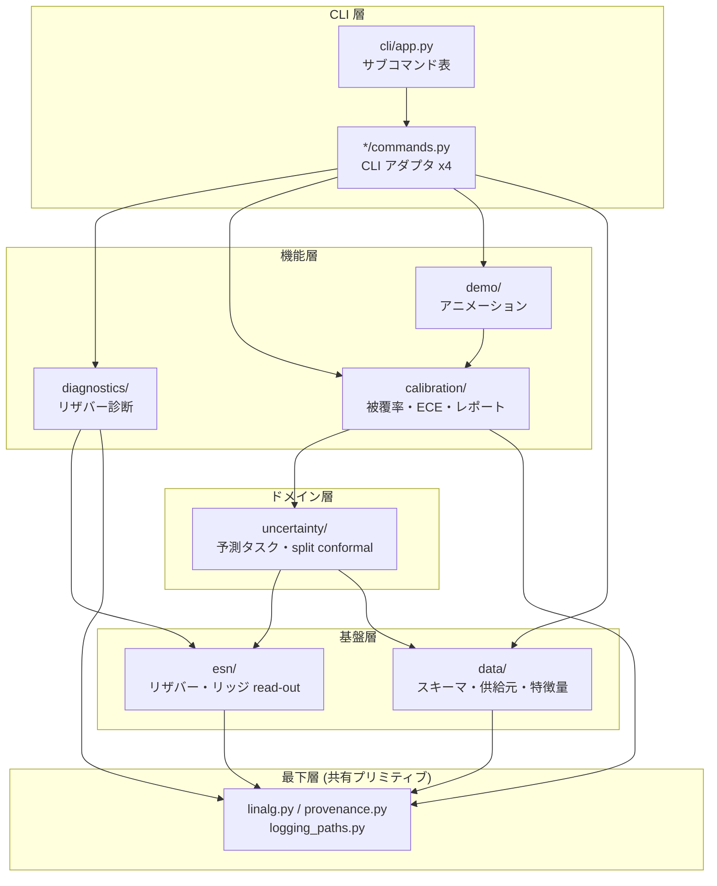
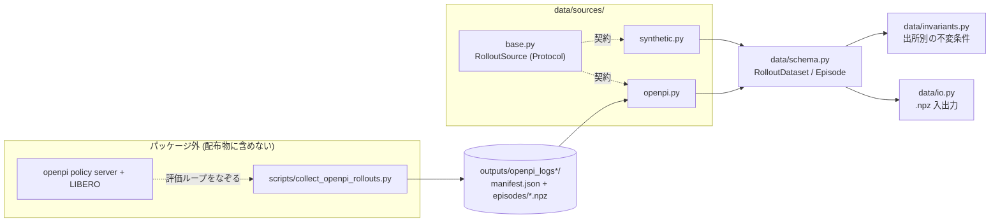
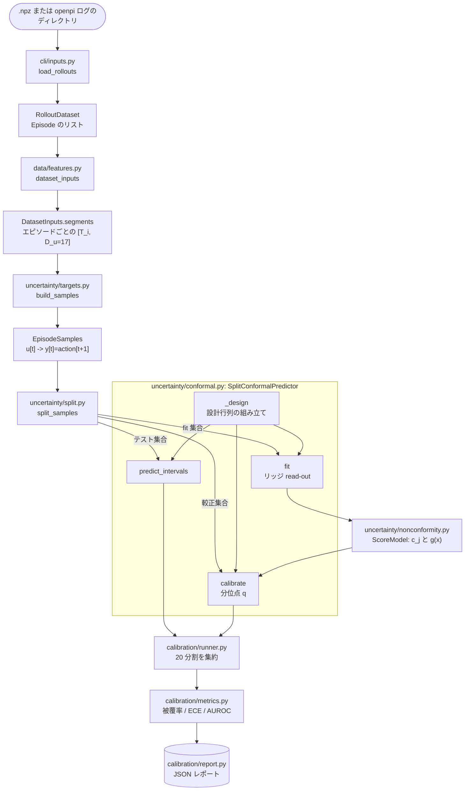
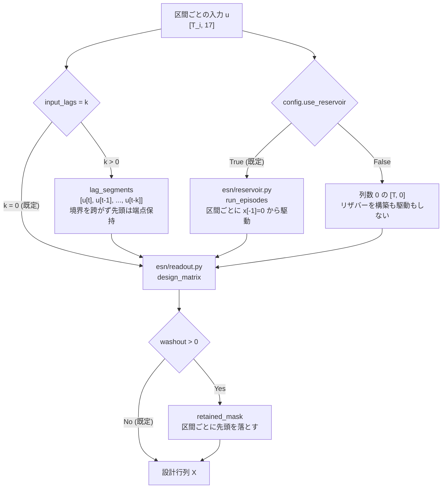
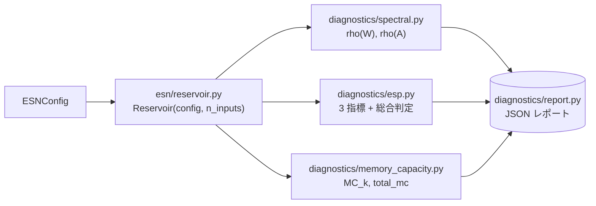
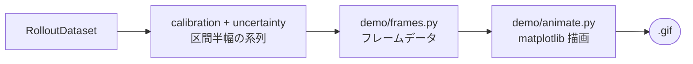

# アーキテクチャとデータフロー

現在の実装の構成図。`docs/design.md` が「なぜそう決めたか」を書くのに対し、この文書は
**いま何がどう繋がっているか**だけを図にする。

図中のノードは実ファイルに対応させ、各図の下に対応表を置く。依存の向きは
`tests/test_layering.py` が機械的に固定しているものと、`src/` の import 文から
実際に抽出したものに一致させてある。

______________________________________________________________________

## 1. レイヤ構成

**依存は上から下への一方向で、循環は無い。**

| ノード          | 実体                                                                         | 役割                                                                     |
| --------------- | ---------------------------------------------------------------------------- | ------------------------------------------------------------------------ |
| `cli/app.py`    | `SUBCOMMANDS` テーブル                                                       | サブコマンドの登録を 1 箇所に集約 (A6)                                   |
| `*/commands.py` | `diagnostics` / `calibration` / `demo` / `data` の各 `commands.py`           | `argparse.Namespace` を型付き設定へ変換する入口 (A7)。ロジックは持たない |
| `diagnostics/`  | `spectral` `esp` `memory_capacity` `trajectory` `runner` `report`            | リザバー単体、および駆動された軌道の診断                                 |
| `calibration/`  | `metrics` `runner` `report` `plot`                                           | 被覆率・reliability curve・ECE・AUROC 区間                               |
| `uncertainty/`  | `targets` `split` `nonconformity` `conformal`                                | 予測タスクの構築と split conformal                                       |
| `esn/`          | `config` `reservoir` `readout` `model`                                       | リザバー生成と閉形式リッジ解                                             |
| `data/`         | `schema` `invariants` `io` `features` `synthetic` `failure_modes` `sources/` | ロールアウトの表現・検証・変換                                           |
| 最下層          | `linalg.py` `provenance.py` `logging_paths.py`                               | 複数層が使う小さな共有物                                                 |

> **`*/commands.py` だけが `cli/options.py` を参照する。** 機能層の本体 (`runner` /
> `report`) は CLI を知らない。図では見やすさのため CLI アダプタを 1 ノードに束ねた。

______________________________________________________________________

## 2. 供給元の抽象化と openpi の境界

- **実線** = データが流れる、**点線** = 契約・実行時の関係
- `scripts/collect_openpi_rollouts.py` **だけ**が openpi と LIBERO を必要とし、wheel
  にも sdist にも含まれない。パッケージ本体は収集済みログを読むだけで依存は numpy のみ
- `io.py` / `invariants.py` / `sources/base.py` は**具象供給元を import しない**
  (`tests/test_layering.py` が固定)

______________________________________________________________________

## 3. データフロー: `calibrate`

| ノード           | 実体                           | 備考                                                      |
| ---------------- | ------------------------------ | --------------------------------------------------------- |
| `load_rollouts`  | `cli/inputs.py`                | パスの形で `.npz` かログディレクトリかを判別              |
| `dataset_inputs` | `data/features.py`             | **エピソード境界で切った区間の列**を第一級で返す (3.9 節) |
| `build_samples`  | `uncertainty/targets.py`       | 各エピソードの最終ステップを落として `T_i - 1` 標本       |
| `split_samples`  | `uncertainty/split.py`         | 既定は `within_task`。`across_task` は交換可能性が崩れる  |
| `_design`        | `uncertainty/conformal.py`     | 4 節の分岐が集まる場所                                    |
| `ScoreModel`     | `uncertainty/nonconformity.py` | `g(x)` は**入力の順位**から作る (リザバー状態を見ない)    |

______________________________________________________________________

## 4. 設計行列の組み立て——アブレーションの分岐点

`_design` が何を作るかは 3 つのスイッチで決まる。11〜16 節の測定はすべてここを
切り替えて行った。

設計行列の中身と、それが答える問い:

| 条件           | 設計行列              | 指定方法                              | 何を測るか                 |
| -------------- | --------------------- | ------------------------------------- | -------------------------- |
| 既定           | `[1, u, x]`           | —                                     | 現行                       |
| パススルー無し | `[1, x]`              | `--readout reservoir_only`            | パススルーの寄与 (11 節)   |
| リザバー無し   | `[1, u]`              | `--readout input_only`                | リザバーの寄与 (11 節)     |
| 遅延線         | `[1, u, u[t-1..t-k]]` | `--readout input_only --input-lags k` | 記憶に価値があるか (16 節) |

- **リザバーは常に生の `u` で駆動する。** ラグは read-out の設計行列にだけ入る
- `washout` は `ESNConfig.washout` **ではない**。較正経路に効くのは
  `SplitConformalPredictor.washout` (既定 0) のほう (12.1 節)
- `input_lags` を `ESNConfig` ではなく predictor 側に置いたのは、`ESN.fit` で効かない
  値を `ESNConfig` に足すと「効かないのに記録される」問題 (A3) を悪化させるため

______________________________________________________________________

## 5. データフロー: `diagnose`

較正とは独立で、**データセットを取らない**。`ESNConfig` からリザバーを建てて測る。

**3 指標とも同じリザバーを見る。** メモリ容量はスカラー駆動を要求するが、`D_u > 1`
のときは `input_channel` の列にだけ信号を流すことで同一リザバーを保つ。以前は
`D_u=1` の別リザバーを建てており、1 つのレポートに別々のリザバーの数値が並んで
いた (13.1 節)。

`diagnostics/trajectory.py` はこの経路には入らない。**駆動された軌道**を見る別系統で、
実データを流したあとの状態列を入力に取る (14 節)。

______________________________________________________________________

## 6. データフロー: `demo`

**フレームデータと描画を分けてある。** 実 LIBERO 映像が入手できた時点で
`frames.py` 側だけを差し替えられるようにするため。`animate.py` は任意依存
(`esn-vla-uq[viz]`) で、数値は matplotlib 無しでも出る。

______________________________________________________________________

## 7. 出力

| コマンド              | 出力先                              | 中身                                                |
| --------------------- | ----------------------------------- | --------------------------------------------------- |
| `diagnose`            | `<out>/diagnostics/*.json`          | スペクトル・ESP・メモリ容量。schema 0.3.0           |
| `calibrate`           | `<out>/calibration/*.json`          | 被覆率・reliability curve・ECE・AUROC。schema 0.2.0 |
| `calibrate --diagram` | `<out>/calibration/reliability.png` | reliability diagram (matplotlib)                    |
| `gen-sample-data`     | 指定の `.npz` + `.json`             | 合成ロールアウト                                    |
| `demo`                | 指定の `.gif`                       | 不確実性の推移                                      |

どちらのレポートも `esn_config` に **`ESNConfig` の全フィールド**を機械的に写す
(`asdict`)。ハイパーパラメータを 1 つ足しても JSON から黙って欠落しない (A2)。
そのため**どの設定で出した数値かはレポート単体で判別できる**。

______________________________________________________________________

## 関連文書

- [`docs/design.md`](design.md) — 設計判断とその根拠、判断を変えた実測値
- [`docs/next-research-directions.md`](next-research-directions.md) — 何を測り、
  何が決着し、何が決着しなかったか
- [`docs/next-pr-candidates.md`](next-pr-candidates.md) — 既知の積み残し (A1〜A9 等の ID)
