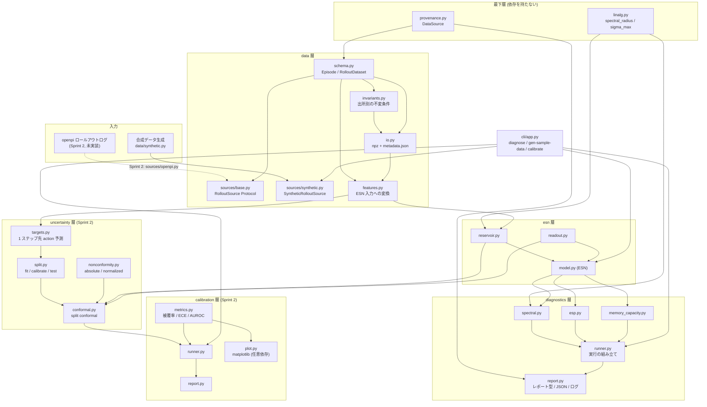

# esn-vla-uq 設計書 v0.1

- ステータス: Sprint 1 (T2) で再作成。ユーザー承認済み仕様書 `docs/plans/sprint1_v0.1.md` に基づく。
  T3（ESN コア）/T4（リザバー診断）/T5（合成データ）は実装済みで、`make ci` は
  緑（全テストパス）。
- 対応要件: `docs/要件_Phase0リポジトリ化_v0.1.md`
- 本書の位置づけ: **ESN コア (T3) とリザバー診断 (T4) の実装が従う規範仕様（唯一の真実）**。
  第 3 節・第 4 節に書かれた記法・アルゴリズム・既定値と実装が食い違った場合は、原則として
  実装ではなく本書を正とし、変更するときは本書を先に改訂する（ただし §3.3 の生成順序のように
  実装側を正として本書を追認した箇所もある。個別の経緯は該当節に明記する）。
  実装済み後も、本書は `src/esn_vla_uq/{esn,diagnostics,data}/` が満たすべき **仕様** として
  読む。実装との既知の乖離は第 8 節「未解決の設計論点」に記録する。

## 目次

01. [目的・非目標](#1-%E7%9B%AE%E7%9A%84%E9%9D%9E%E7%9B%AE%E6%A8%99)
02. [アーキテクチャ](#2-%E3%82%A2%E3%83%BC%E3%82%AD%E3%83%86%E3%82%AF%E3%83%81%E3%83%A3)
03. [ESN の数学仕様](#3-esn-%E3%81%AE%E6%95%B0%E5%AD%A6%E4%BB%95%E6%A7%98)
04. [診断指標の定義](#4-%E8%A8%BA%E6%96%AD%E6%8C%87%E6%A8%99%E3%81%AE%E5%AE%9A%E7%BE%A9)
05. [データスキーマ v0.1](#5-%E3%83%87%E3%83%BC%E3%82%BF%E3%82%B9%E3%82%AD%E3%83%BC%E3%83%9E-v01)
06. [将来スプリントの決定事項](#6-%E5%B0%86%E6%9D%A5%E3%82%B9%E3%83%97%E3%83%AA%E3%83%B3%E3%83%88%E3%81%AE%E6%B1%BA%E5%AE%9A%E4%BA%8B%E9%A0%85)
07. [合成データの位置づけに関する誠実性宣言](#7-%E5%90%88%E6%88%90%E3%83%87%E3%83%BC%E3%82%BF%E3%81%AE%E4%BD%8D%E7%BD%AE%E3%81%A5%E3%81%91%E3%81%AB%E9%96%A2%E3%81%99%E3%82%8B%E8%AA%A0%E5%AE%9F%E6%80%A7%E5%AE%A3%E8%A8%80)
08. [未解決の設計論点（Sprint 2 持ち越し）](#8-%E6%9C%AA%E8%A7%A3%E6%B1%BA%E3%81%AE%E8%A8%AD%E8%A8%88%E8%AB%96%E7%82%B9sprint-2-%E6%8C%81%E3%81%A1%E8%B6%8A%E3%81%97)
09. [conformal 予測区間と較正評価（Sprint 2）](#9-conformal-%E4%BA%88%E6%B8%AC%E5%8C%BA%E9%96%93%E3%81%A8%E8%BC%83%E6%AD%A3%E8%A9%95%E4%BE%A1sprint-2)
10. [openpi 接続（実仕様の確認と収集層）](#10-openpi-%E6%8E%A5%E7%B6%9A%E5%AE%9F%E4%BB%95%E6%A7%98%E3%81%AE%E7%A2%BA%E8%AA%8D%E3%81%A8%E5%8F%8E%E9%9B%86%E5%B1%A4)

______________________________________________________________________

## 1. 目的・非目標

### 目的

- openpi (π0) の LIBERO 評価ロールアウトから得られる action chunk 系列・固有受容感覚時系列を入力に、
  自前実装の Echo State Network (ESN) read-out で不確実性スコア・予測区間を算出する。
- 算出手法の妥当性を担保するリザバー診断（スペクトル半径・ESP・メモリ容量）をコマンド一発で出力し、
  「閉形式・アンサンブル不要・物理リザバーへ移植可能」という差別化を技術的に裏付ける。
- Sprint 1 のゴールは `uv sync && uv run esn-vla-uq diagnose` が同梱合成データ上で
  再現可能な診断結果を出すところまで（`docs/plans/sprint1_v0.1.md` 1 節）。

### 非目標（v0.1 全体を通して）

- **Phase 1 以降**: 物理リザバー・メモリスタ実装。ソフト ESN での実証が先。
- **四足歩行・ロコモーションへの横展開**: v0.2 以降。
- **π0 以外の VLA 対応**（SmolVLA, GR00T 等）: データ収集層 (`data/sources/` の
  `RolloutSource` Protocol) は将来対応を見越して抽象化するが、v0.1 では実装しない。
- **リアルタイム介入**: 不確実性による実行停止・リカバリは行わない。検知のみ。
- **ハイパーパラメータの網羅的探索**: v0.1 は「動いて診断結果が出る」ことが目的であり、
  性能チューニングはスコープ外。

______________________________________________________________________

## 2. アーキテクチャ

### 2.1 openpi との疎結合

openpi はランタイム依存に含めない。openpi 側のロールアウトログは
`esn_vla_uq.data.sources.RolloutSource` Protocol を実装するアダプタ（Sprint 2 の
`OpenpiLogSource`）経由でのみ取り込む。これにより openpi の破壊的変更から本パッケージを
絶縁する（要件書「技術的制約」節）。

### 2.2 レイヤ構成とモジュール境界



モジュール境界の契約:

- **最下層（`linalg.py` / `provenance.py`）**: どちらも本パッケージの他モジュールを
  import しない。複数の層が同じ定義を必要とするとき、片方の層に置いて他方から
  import すると層をまたぐ辺が生まれるため、ここへ置く。
  `linalg.spectral_radius` は `esn/reservoir.py`（`W` のスケーリング）と
  `diagnostics/spectral.py`（診断値）が**同一の実装**を共有するための場所であり、
  「設定した rho が達成されているか」を実測で検証するという診断の意味は、この
  同一性に依存する（`tests/test_linalg.py` が同一性そのものを固定している）。
  `provenance.DataSource` は `data` 層と `diagnostics` 層の両方が使う。
- **data → esn**: `esn` 層は `RolloutDataset` を直接知らない。`esn.model.ESN.fit/predict` は
  `numpy.typing.NDArray[np.float64]` のみを受け取る。dataset から ESN 入力への変換は
  `data/features.py` の `dataset_inputs` に一本化する（3.9 節）。呼び出し側が
  各自で配列を組み立てることはしない。
- **esn → diagnostics**: レイヤ順は data → esn → diagnostics であり、`diagnostics` が
  `esn` の公開 API（`esn.reservoir.Reservoir`、`esn.readout.RidgeReadout`、
  `esn.config.ESNConfig`）に依存するのは**正方向の依存**として許可する
  （`diagnostics/esp.py`・`diagnostics/memory_capacity.py`・`diagnostics/runner.py` は
  いずれも `Reservoir` を import して使う）。逆に **`esn` 層が `diagnostics` に依存する
  ことは禁止**する。この境界を守れば、状態更新式やリッジ解を `diagnostics` 側で
  再実装せずに済む。
- **openpi との境界**: `RolloutSource.load() -> RolloutDataset` が唯一の契約点。
  実装の詳細（openpi の policy server API 等）は `data/sources/openpi.py`（Sprint 2）に
  閉じ込める。抽象（`sources/base.py`）と具象（`sources/synthetic.py` 等）を分ける
  のは、Protocol を参照するだけの利用側が具象パーサをロードしないためである。
  同じ理由で、出所ごとの不変条件は具象パーサ側ではなく `data/invariants.py`
  （依存は `schema.py` と `provenance.py` のみ）に置き、`io.py` はレジストリを
  引くだけにする。`io.py` が具象パーサを import する形だと、`source == "openpi"` の
  分岐を足した時点で `io.py` が openpi に依存する。
  **この境界が実際に守られているかは `tests/test_layering.py` が検査する。**
  ただし保証の範囲には限界がある: `esn_vla_uq/data/__init__.py` が公開 API を
  再エクスポートしているため、`data` 配下のどれか 1 つを import すれば合成データ
  生成器はロードされる。テストが守っているのは (1) `io.py` / `invariants.py` /
  `sources/base.py` が具象を import 文として持たないこと、(2) 任意依存
  （openpi）を持つ供給元がどの経路からもロードされないこと、の 2 点である。
- **I/O とロギングの一元化**: 出力先パス（`--output-dir` 等）の決定は `cli/app.py` と
  各サブコマンドの `*_commands.py`（`diagnostics/commands.py` / `data/commands.py`）が
  担う。実際のファイル書き込みは各層の永続化モジュールに委ねる
  （`data/io.py` の `save_dataset`/`load_dataset` が npz + JSON サイドカーを、
  `diagnostics/report.py` の `write_report` が診断 JSON を書く）。`esn` 層と
  `data.schema` は純粋関数的（入出力は引数と戻り値のみ）に保つ。`logging.basicConfig`
  の呼び出しは `cli/app.py` のみが行う。

______________________________________________________________________

## 3. ESN の数学仕様

本節は T3（ESN コア実装）が一意に実装できることを目的とした規範的仕様である。

### 3.1 記法

| 記号               | 意味                                                            |
| ------------------ | --------------------------------------------------------------- |
| `N`                | リザバーニューロン数（`ESNConfig.n_reservoir`）                 |
| `D_u`              | 入力次元（`fit`/`run` に渡される配列の shape から実行時に推定） |
| `D_y`              | 出力（教師信号）次元                                            |
| `T`                | 系列長                                                          |
| `u[t] ∈ R^{D_u}`   | 時刻 `t` の入力ベクトル                                         |
| `x[t] ∈ R^N`       | 時刻 `t` のリザバー状態。`x[0] = 0`（零ベクトル）               |
| `y[t] ∈ R^{D_y}`   | 時刻 `t` の教師信号（`fit` 時）または予測（`predict` 時）       |
| `a`                | `leak_rate`（リーク統合係数）                                   |
| `ρ`                | `spectral_radius`（目標スペクトル半径）                         |
| `λ`                | `ridge_alpha`（リッジ正則化係数）                               |
| `W_in ∈ R^{N×D_u}` | 入力重み行列                                                    |
| `W ∈ R^{N×N}`      | リザバー内部結合重み行列                                        |
| `b ∈ R^N`          | バイアスベクトル                                                |
| `W_out`            | read-out 重み行列                                               |

### 3.2 `ESNConfig` と既定ハイパーパラメータ

`@dataclass(frozen=True)` として定義する。以下は本書が定める既定値であり、CLI の
`diagnose` サブコマンドの既定値もこれに一致させる。

| フィールド          | 型      | 既定値 | 検証（`__post_init__`、違反時 `ValueError`）       |
| ------------------- | ------- | ------ | -------------------------------------------------- |
| `n_reservoir`       | `int`   | `200`  | `n_reservoir >= 1`                                 |
| `spectral_radius`   | `float` | `0.9`  | `spectral_radius > 0`                              |
| `input_scaling`     | `float` | `1.0`  | 制約なし（0 も許容: 入力を無視するリザバーになる） |
| `bias_scaling`      | `float` | `0.0`  | 制約なし                                           |
| `leak_rate`         | `float` | `1.0`  | `0 < leak_rate <= 1`                               |
| `density`           | `float` | `0.1`  | `0 < density <= 1`                                 |
| `ridge_alpha`       | `float` | `1e-6` | `ridge_alpha >= 0`                                 |
| `washout`           | `int`   | `100`  | `washout >= 0`                                     |
| `input_passthrough` | `bool`  | `True` | —                                                  |
| `seed`              | `int`   | `0`    | —                                                  |

`ValueError` のメッセージには違反したパラメータ名と実値を含める
（例: `f"spectral_radius must be > 0, got {spectral_radius}"`）。

`input_passthrough` を既定 `True` とする理由（ユーザー確定事項 10）: read-out に生入力
`u[t]` を直接与えることで、リザバーが十分に学習していない次元（線形にしか効かない情報）を
read-out 側の線形項が補い、小さい `N` でも実用的な予測精度を確保できるため。診断用途
（第 4 節）では `ESN.fit` を介さず `reservoir.run` を直接使うため `input_passthrough` の
影響を受けない。

### 3.3 リザバー生成手順（`esn/reservoir.py`）

`rng = np.random.default_rng(seed)` から、**以下の順序で** 乱数を消費する
（順序を変えると同一 seed でも異なる `W_in`/`W`/`b` になるため、この順序を実装上の正とする。
`W` 内部では `mask` を `raw`（一様乱数本体）より先に消費する。実装が先で、本節はその
消費順序を実装から書き起こして規範化したものであり、`tests/test_reservoir.py` の
`test_rng_consumption_order_matches_golden_values` / `test_reservoir_matches_golden_values_end_to_end`
が既知 seed に対するゴールデン値でこの消費順序の回帰を機械的に検知する）。

```text
1. W_in_raw = rng.uniform(-1, 1, size=(N, D_u))
   W_in = W_in_raw * input_scaling

2. b_raw = rng.uniform(-1, 1, size=(N,))
   b = b_raw * bias_scaling

3. mask = rng.random((N, N)) < density         # Bernoulli(density) の疎結合マスク
4. W_dense = rng.uniform(-1, 1, size=(N, N))
5. W_unscaled = np.where(mask, W_dense, 0.0)    # マスク外の要素は 0

6. eigvals = np.linalg.eigvals(W_unscaled)
   rho_actual = float(np.max(np.abs(eigvals)))
   if rho_actual == 0.0:
       raise ValueError("generated reservoir matrix has zero spectral radius; "
                         "increase density or n_reservoir")
7. W = W_unscaled * (spectral_radius / rho_actual)
```

生成順序全体としては `W_in` → `b` → `W`（`W` の内部は `mask` → `W_dense`）の順で
`rng` を消費する。`esn/reservoir.py` の `Reservoir.__init__` はこの順に
`_make_input_matrix` → `_make_bias` → `_make_recurrent_matrix` を呼ぶ。

`D_u` は `fit`/`run` に渡された入力配列の第 2 軸から実行時に決定する（`ESNConfig` には
持たせない）。

### 3.4 状態更新式

```
x[t] = (1 - a) * x[t-1] + a * tanh(W_in @ u[t] + W @ x[t-1] + b)      for t = 1..T
x[0] = 0 (零ベクトル)
```

- 活性化関数は `tanh` 固定（差し替え口は将来のために型シグネチャ上は残すが、v0.1 の実装は
  `tanh` のみをサポートする。ソフト制約: 活性化関数固定）。
- `leak_rate = 1.0` のとき上式は `x[t] = tanh(W_in @ u[t] + W @ x[t-1] + b)` に退化する
  （リークなし更新と数値的に完全一致すること。T3 受け入れ基準）。
- `esn/reservoir.py` の `run(inputs, initial_state) -> NDArray[np.float64]` は状態行列
  `[T, N]`（各時刻の `x[t]`, `t = 1..T`。`x[0]` は含まない）を返す。`initial_state` 省略時は
  零ベクトルを使う。

### 3.5 washout（過渡状態の破棄）

リザバーの初期状態 `x[0]=0` からの立ち上がり区間は入力の履歴を十分に反映していないため、
read-out の学習・評価から除外する。`reservoir.run` 自体は washout を行わない（全時刻の
状態を返す）。washout の適用は呼び出し側の責務とし、`esn/reservoir.py` に
`discard_washout(states, washout) -> NDArray[np.float64]`（先頭 `washout` 行を切り捨てる
ヘルパ）を提供する。`ESN.fit` はこのヘルパを内部で使い `ESNConfig.washout` を適用する。
`ESN.predict` は washout を適用せず、`u` と同じ長さ `T` の予測系列を返す
(評価時に washout 区間を除外するかどうかは呼び出し側が決める)。

### 3.6 リッジ read-out（`esn/readout.py` の `RidgeReadout`）

設計行列 `X ∈ R^{T'×p}`（`T'` は washout 後の系列長）を構築する:

- `input_passthrough = True`（既定）: `X[t] = [1, u[t], x[t]]`（列を連結。次元
  `p = 1 + D_u + N`）
- `input_passthrough = False`: `X[t] = [1, x[t]]`（`p = 1 + N`）

閉形式解:

```
Λ = diag(0, λ, λ, ..., λ)     # バイアス列 (先頭 1 列) は正則化対象外
W_out = solve(X^T X + Λ, X^T Y)      # np.linalg.solve を使う（np.linalg.inv は使わない）
```

`Y ∈ R^{T'×D_y}` は教師信号行列。予測は `Y_hat = X @ W_out`。

- `ridge_alpha = 0` に近づけたとき、`X^T X` が正則であれば解は最小二乗解
  （`np.linalg.lstsq(X, Y)`）と一致する（T3 受け入れ基準: `ridge_alpha=1e-10` で
  `rtol=1e-6` 一致）。
- `ridge_alpha` を増やすほど `‖W_out‖_F` は単調非増加（リッジ回帰の一般的性質）。

### 3.7 `ESN`（`esn/model.py`）の契約

- `fit(u, y) -> None`: `reservoir.run(u)` → `discard_washout` → `RidgeReadout` を学習し
  内部状態として保持する。教師強制 (teacher forcing) は行わない。
- `predict(u) -> NDArray[np.float64]`: 学習済み read-out で予測する。未 `fit` で呼ぶと
  `RuntimeError` を送出する。
- `transform(u) -> NDArray[np.float64]`: read-out を経由せず、washout 適用前のリザバー
  状態行列 `[T, N]` をそのまま返す（診断モジュールや将来の `uncertainty` 層が生の状態を
  必要とする場合に使う）。
- すべての公開関数の入出力は `numpy.typing.NDArray[np.float64]` で型注釈する。数値スカラー
  は `float(...)` で明示変換する（`disallow_any_explicit` と numpy の相性問題への対処。
  `docs/plans/sprint1_v0.1.md` 落とし穴 4）。

### 3.8 計算量と `N` の実用上限

スペクトル半径計算は疎行列ライブラリを使わず `np.linalg.eigvals` による密固有値計算
（`O(N^3)`）を用いる（ソフト制約: scipy を入れない）。性能要件
（`diagnose --n-reservoir 500` が CPU 単体で 60 秒以内）から、以下を実用上の目安とする:

- 既定値 `N = 200` は診断の反復実行（開発時）でも数秒以内に収まる想定。
- `N <= 500` を Sprint 1 で動作確認する上限とする（受け入れ基準に含まれる唯一の実測点）。
- `N > 500` は密固有値計算のコストが急増するため、Sprint 1 では性能を保証しない。
  将来 `N` を大きくする要求が出た場合は疎行列・反復法（scipy 等）の導入を検討する
  （第 8 節「未解決の設計論点」）。

### 3.9 ロールアウトから ESN 入力への変換とエピソード境界

`RolloutDataset` は永続化と検証のための形（エピソードのリスト）であり、ESN が必要と
する形（`[T, D_u]` の float64 配列）とは違う。この変換は `data/features.py` の
`dataset_inputs` に一本化する。呼び出し側ごとに実装させると、以下 2 つの判断が
実装ごとにばらつくためである。

**エピソード境界でリザバー状態をリセットする。** エピソードは互いに独立した試行で
あり、直前のエピソード末尾の状態を次のエピソードへ持ち越すと、実際には観測して
いない過去に依存した特徴量になる。連結済み配列を `Reservoir.run` にそのまま渡すと
まさにそれが起きる。したがって:

- `dataset_inputs` はエピソードごとに切り出した区間の列（`DatasetInputs.segments`）を
  第一級の表現として返す。
- `esn.reservoir.run_episodes(reservoir, segments)` が区間ごとに初期状態から駆動し、
  結果を連結して `[T_total, N]` を返す。
- 連結済みの `DatasetInputs.values` を直接 `Reservoir.run` に渡してはならない。

これは「どちらでも動くが片方が誤り」という種類の選択であり、静かに間違えたときに
数値だけを見ても気づけない。`tests/test_features.py` は、区間ごとの駆動と連結配列の
一括駆動が**異なる結果になる**ことを固定している（一致するならこの選択に意味が
無いことになる）。

**NaN はこの層で埋めない。** `state` / `action` は `Episode.validate()` の
`check_all_finite` により有限性が保証されているため、`FeatureSet`（`"state"` /
`"action"` / `"state_action"`）が返す入力に NaN は入らない。NaN を含みうるのは
`action_chunk` だけで、非推論ステップは全要素 NaN と定義されている（5.1 節）。
したがってチャンク由来の特徴量は `is_inference_step` が真のステップでのみ定義され、
`DatasetInputs.is_inference_step` を通じて呼び出し側に渡す。NaN を 0 などで埋めると
「予測が無かった」と「予測が 0 だった」が区別できなくなるため、この層では埋めない。
チャンク由来の特徴量設計そのものは Sprint 2 の作業とする。

______________________________________________________________________

## 4. 診断指標の定義

本節は T4（リザバー診断モジュール）が一意に実装できることを目的とした規範的仕様である。
依拠文献は Jaeger 2001（メモリ容量）、Yildiz et al. 2012（ESP 再検討）、
Lukoševičius 2012（実務ガイド）。文献情報の確度は本書末尾「参考文献」節に明記する。

### 4.1 スペクトル半径（`diagnostics/spectral.py`）

- `spectral_radius(W) -> float`: `max(|eigvals(W)|)`。`np.linalg.eigvals` を使用し、
  戻り値は `float(...)` で明示変換する。
- `effective_spectral_radius(W, leak_rate) -> float`: リーク統合を含めた実効更新行列
  `A = (1 - a) * I + a * W` の `spectral_radius(A)`。`leak_rate = 1.0` のとき `A = W` に
  退化し `effective_spectral_radius == spectral_radius(W)` と一致する。
- `largest_singular_value(A) -> float`: `A` の最大特異値 `σ_max(A)`
  （`np.linalg.svd` または `np.linalg.norm(A, ord=2)`）。ESP の十分条件判定に使う。

### 4.2 Echo State Property (ESP) の判定（`diagnostics/esp.py`）

ESP は「有限の過去入力に対して、初期状態に依存せず状態が一意に収束する」性質である。
単一の指標では判定を誤りうるため、**3 指標を必ず同時に計算し**、いずれか一つだけで
最終判定（`verdict`）を下さない（`docs/plans/sprint1_v0.1.md` 想定リスク 3）。

実効更新行列を `A = (1 - a) * I + a * W`（`a = leak_rate`）とする。

1. **十分条件** `sufficient_condition_met`: `σ_max(A) < 1`
   （`largest_singular_value(A) < 1`）。これが成り立てば、`A` を含む写像は任意の有界入力
   に対して大域的に縮小写像であり、ESP は数学的に保証される（Yildiz et al. 2012）。
   **この条件は保守的**であり、既定設定 `ρ = 0.9` でも満たされないことが多い
   （正規行列でない限り一般に `σ_max(W) > ρ(W)`。ランダムなスパース行列では
   `σ_max` が `ρ` を大きく上回りやすい）。
2. **必要条件** `necessary_condition_met`: `ρ(A) < 1`
   （`effective_spectral_radius(W, leak_rate) < 1`）。原点近傍での線形化が漸近安定である
   ための必要条件。これが不成立（`ρ(A) >= 1`）であっても、tanh の飽和により
   駆動入力がある実際の系では経験的に収束する場合がある（Yildiz et al. 2012 が指摘する
   「0 入力近傍の線形条件」と「実際に駆動される系」の乖離）。
3. **経験的収束判定** `empirical_converged` と `decay_rate`:
   同一のテスト入力系列 `u[1..T]` を、`K = 8` 個の異なるランダム初期状態
   `x_1[0], ..., x_K[0]` から駆動する。各時刻 `t` で K 個の状態間の最大ペアワイズ
   L2 距離 `d(t) = max_{i,j} ‖x_i[t] - x_j[t]‖_2` を計算する。
   - `empirical_converged = d(T) < tol`（既定 `tol = 1e-6`）
   - `decay_rate`: `{(t, log(d(t) + ε)) : d(t) > 0}` に対する最小二乗の傾き
     （`np.polyfit(t, log(d(t) + ε), 1)` の 1 次係数）。`ε` は `log(0)` を避けるための
     微小値（例 `1e-300`）。収束していれば `decay_rate < 0`。

**既定のテスト入力・初期状態分布**（`check_esp` の引数を省略した場合）:

| 項目                                                                               | 既定値                                                               |
| ---------------------------------------------------------------------------------- | -------------------------------------------------------------------- |
| テスト系列長 `T`                                                                   | 500                                                                  |
| テスト入力 `u[t]`                                                                  | i.i.d. `Uniform(-1, 1)^{D_u}`（呼び出し元が `D_u=0` 相当の           |
| 零入力系列を明示的に渡すことも可能。零入力は必要条件の検証に近い最も厳しいテストに |                                                                      |
| 相当する）                                                                         |                                                                      |
| 初期状態 `x_k[0]` (`k=1..K`)                                                       | i.i.d. `Uniform(-1, 1)^N`（リザバー活性化の飽和範囲                  |
| `[-1, 1]` に合わせる）                                                             |                                                                      |
| 乱数                                                                               | `check_esp` に渡された `seed` から派生させた `np.random.default_rng` |

`check_esp(...) -> EspResult` は `sufficient_condition_met`, `necessary_condition_met`,
`empirical_converged`, `decay_rate`, `verdict` をすべて含むデータクラスを返す。

#### 判定表（`verdict: Literal["esp_holds", "esp_likely", "esp_violated"]`）

`σ_max(A) < 1 ⟹ ρ(A) < 1`（任意の正方行列で `ρ(A) <= σ_max(A)` が成り立つため）が数学的
に常に成立するので、`sufficient_condition_met = True` かつ `necessary_condition_met = False`
の組み合わせは理論上生じない（浮動小数点誤差で境界値がまれに食い違う場合は警告ログを
出し `esp_likely` にフォールバックする）。

| #   | 十分条件 (S)          | 必要条件 (N) | 経験的収束 (E) | `verdict`      | 根拠                                                                                                                                                                                                     |
| --- | --------------------- | ------------ | -------------- | -------------- | -------------------------------------------------------------------------------------------------------------------------------------------------------------------------------------------------------- |
| 1   | True                  | True/False\* | —              | `esp_holds`    | 十分条件が成立すれば任意の有界入力に対して ESP が数学的に保証される。経験的判定の結果によらず確定（\*理論上 N は常に True。浮動小数点で N=False になった場合は #6 として扱う）                           |
| 2   | False                 | True         | True           | `esp_holds`    | 必要条件を満たし、かつテスト入力に対して経験的収束を確認。テストした入力範囲内での ESP 成立を強く支持する                                                                                                |
| 3   | False                 | True         | False          | `esp_likely`   | 必要条件は満たすが規定の `tol`/`T` では収束を確認できず。`T` 不足や減衰が遅いだけの可能性があり、不成立の証拠ではない                                                                                    |
| 4   | False                 | False        | True           | `esp_likely`   | 必要条件（原点近傍の線形安定性）は不成立だが、tanh の飽和によりテストした入力に対しては経験的に収束。**このテスト入力に限定した観測**であり、他の入力分布での成立は保証しないため `esp_holds` にはしない |
| 5   | False                 | False        | False          | `esp_violated` | 必要条件不成立かつ経験的収束も確認できず。ESP 不成立の強い証拠                                                                                                                                           |
| 6   | True (浮動小数点誤差) | False        | —              | `esp_likely`   | 理論上生じない組み合わせ。数値誤差として扱い警告ログを出す                                                                                                                                               |

Sprint 1 T4 の受け入れ基準（`docs/plans/sprint1_v0.1.md`）: `ρ=0.9, leak=1.0, 零入力` で
`verdict == "esp_holds"` かつ `decay_rate < 0`（上表 #1 または #2 に該当する想定）。
`ρ=1.5` で `necessary_condition_met is False` かつ `verdict == "esp_violated"`
（上表 #5。`ρ=1.5` かつ零入力では経験的収束も通常観測されないため）。

この判定表の妥当性（特に #4 の扱い）は Sprint 1 の想定リスク 3 に該当する。実装時に
既定設定で十分条件と経験的判定が食い違うケースが頻発する場合は、表を変更せず人間に
確認する（第 8 節）。

### 4.3 メモリ容量（`diagnostics/memory_capacity.py`）

Jaeger (2001) の線形メモリ容量 (linear memory capacity) を採用する
（複数定義のうち、read-out を遅延ごとに学習し相関の二乗で評価する版）。

`linear_memory_capacity(reservoir, ...)` 自体は常にスカラー入力（`D_u=1`）の
`reservoir` を要求する（`n_inputs != 1` なら `ValueError`）。`spectral`/`esp` を計算する
リザバーと同じものを使うか、別の `D_u=1` リザバーを新たに構築するかの分岐は、この
モジュールではなく呼び出し側の `diagnostics/runner.py`（`run_diagnostics`）が
`--n-inputs == 1` かどうかで判断する（`n_inputs == 1` なら再利用、`n_inputs != 1` なら
`config` から別途 `D_u=1` のリザバーを構築する。詳細は 4.4 節）。

手順:

1. 入力: i.i.d. スカラー `u[t] ~ Uniform(-0.8, 0.8)`、`t = 1..(n_train + n_test + washout)`。
   既定 `n_train = 3000`, `n_test = 1000`, `washout = 200`
   （この `washout` は `ESNConfig.washout` とは独立のメモリ容量診断専用パラメータ）。
2. リザバーを `u` で駆動し状態系列 `x[t]` を得る（`ESNConfig` の `W`, `W_in`, `b`,
   `leak_rate` を使用。`W_in` は `D_u=1` 用に生成する）。
3. 遅延 `k = 1..K`（既定 `K = min(2 * n_reservoir, 200)`）ごとに、教師信号
   `y_k[t] = u[t - k]` に対して独立にリッジ read-out（第 3.6 節と同じ閉形式、
   既定 `ridge_alpha = 1e-8`。**`ESNConfig.ridge_alpha` とは別の、メモリ容量診断専用の
   微小正則化係数**）を学習する。washout 区間は `n_train` の直前に置かれる独立した
   先頭 `washout` ステップ（手順 1 の `t = 1..washout`）であり、`n_train` 区間の内部
   ではない。この washout 区間は学習・評価いずれの対象からも除外する
   （`train` は `t = washout+1 .. washout+n_train`、`test` は
   `t = washout+n_train+1 .. washout+n_train+n_test` の区間）。
4. 各 `k` について、test 区間（`n_test` 件、washout 適用後）で
   `MC_k = corr(ŷ_k, u[t - k])^2`（Pearson 相関係数の二乗）を計算する。
5. `total_mc = Σ_{k=1}^{K} MC_k`
6. `per_delay: list[float]`（長さ `K`、`MC_1, ..., MC_K` の順）
7. `memory_horizon`: `MC_k < 0.1` となる最小の `k`（そのような `k` が存在しない場合は `K`
   を返す）
8. `mc_per_neuron = total_mc / N`

`MemoryCapacityResult` として `total_mc`, `per_delay`, `memory_horizon`,
`mc_per_neuron` を返す。

**負の `MC_k` をクリップしない理由**: 理論上 `MC_k = corr(...)^2 ∈ [0, 1]` だが、
浮動小数点演算誤差により厳密に 0 の近傍でごくわずかに負の値（例: `-1e-16`）が生じうる。
0 にクリップすると、この誤差自体が持つ「相関がほぼゼロである」という情報や、実装の
数値不安定性を検知する手がかりが失われるため、生値をそのまま返す。値を意味論的に
解釈する側（レポート表示等）は `max(MC_k, 0)` 相当として扱ってよいが、診断モジュールの
戻り値としては丸めない。

**正則化強度への感度**: メモリ容量は `ridge_alpha` に敏感である。正則化を強めると
`W_out` のノルムが縮み高遅延成分の相関が過小評価されるため、診断専用の `ridge_alpha`
は意図的に `ESNConfig` の既定値（`1e-6`）より小さい `1e-8` とする。この点を
`diagnostics/memory_capacity.py` の docstring にも明記すること（T4 実装時の必須事項）。

理論上界: `total_mc <= N`（リザバーの自由度がその線形写像で表現できる独立記憶単位数を
超えない）。

### 4.4 診断レポート（`diagnostics/runner.py` と `diagnostics/report.py`）

責務は 2 つのモジュールに分かれる。`runner.py` が「どのリザバーで何を測るか」を
決めて `DiagnosticsReport` を組み立て、`report.py` が結果の表現（レポート型・
JSON 化・ファイル書き出し・ログ整形）を担う。依存は `runner.py` → `report.py` の
一方向。

JSON への変換は各結果型の `to_dict()` に委ねる（`ESNConfig` / `EspResult` /
`MemoryCapacityResult` / `SpectralSummary`）。実装は `dataclasses.asdict` を基礎に
しており、結果型にフィールドを足せば JSON にも自動的に現れる。以前は `report.py`
がフィールド名を手書きで列挙していたため、たとえば ESP に 4 つ目の指標を足しても
mypy も pytest も落ちないまま JSON から欠落した。`to_dict()` に移しただけでは列挙の
場所が変わるだけなので、`tests/test_report_serialization.py` が `dataclasses.fields`
から期待値を導いて「全フィールドが辞書に現れる」ことを固定している。

`@dataclass(frozen=True) DiagnosticsReport` は以下を収録する:

| フィールド        | 内容                                                                                                                                                                                                                                                                                    |
| ----------------- | --------------------------------------------------------------------------------------------------------------------------------------------------------------------------------------------------------------------------------------------------------------------------------------- |
| `schema_version`  | `"0.2.0"`                                                                                                                                                                                                                                                                               |
| `generated_at`    | UTC ISO8601 タイムスタンプ                                                                                                                                                                                                                                                              |
| `package_version` | `esn_vla_uq.__version__`                                                                                                                                                                                                                                                                |
| `numpy_version`   | `numpy.__version__`                                                                                                                                                                                                                                                                     |
| `esn_config`      | `ESNConfig` の全フィールド                                                                                                                                                                                                                                                              |
| `seed`            | 診断実行に使った seed                                                                                                                                                                                                                                                                   |
| `n_inputs`        | `spectral`/`esp` を計算したリザバーの入力次元 `D_u`（`--n-inputs`）                                                                                                                                                                                                                     |
| `spectral`        | `spectral_radius`, `effective_spectral_radius`                                                                                                                                                                                                                                          |
| `esp`             | `EspResult` の全フィールド                                                                                                                                                                                                                                                              |
| `memory_capacity` | `MemoryCapacityResult` の全フィールドに加え、測定コンテキストとして `n_inputs`（測定に使ったリザバーの入力次元。常に 1）と `reservoir`（`"shared"`: `spectral`/`esp` と同じリザバーで測定 / `"separate"`: 別の `D_u=1` リザバーで測定）を持つ。`--skip-memory-capacity` 指定時は `null` |
| `data_source`     | 常に `"synthetic"`（Sprint 1 時点。第 7 節参照）                                                                                                                                                                                                                                        |

`n_inputs`（トップレベル）は当初の設計にはなかったフィールドだが、リザバー行列の
生成が `seed` と入力次元 `D_u` の両方に依存する（3.3 節）ため、事後にどの `D_u` の
リザバーの数値かを判別できるよう追加している。

`MemoryCapacityMeasurement.n_inputs` は `__post_init__` で
`MEMORY_CAPACITY_INPUT_DIM`（=1）以外を `ValueError` にする。この型は
`diagnostics/__init__.py` で公開エクスポートされており、`run_diagnostics` を
介さず単体で構築できてしまうため、`reservoir_label()` が「`spectral`/`esp` と
同じリザバーで測ったか」を正しい文脈なしに誤ったラベルで返しうる問題への
対策（型ではなく実行時契約で強制する）。

`memory_capacity` の測定コンテキスト（`n_inputs` / `reservoir`）は、以前はトップ
レベルの `memory_capacity_n_inputs` という別フィールドに分けていた（0.1.0）。この形式
には 2 つの問題があった: (1) `memory_capacity` を省略したときに `memory_capacity` と
`memory_capacity_n_inputs` のどちらか片方だけ `null` にする実装ミスを型で防げない、
(2) JSON の `memory_capacity` オブジェクトだけを読んでも、それが `spectral`/`esp` と
同じリザバーで測ったものか別物かを事後に判別できない（`n_inputs` が別フィールドに
あるため）。0.2.0 ではこれらを `memory_capacity` オブジェクトの内側に埋め込むことで
解消した（実装は `report.py` の `MemoryCapacityMeasurement`。診断そのものを行う
`diagnostics/memory_capacity.py` の `MemoryCapacityResult` は測定コンテキストを
知らないままにし、レポートの文脈でのみ意味を持つ情報はレポート層でラップする）。

「リザバーは `n_inputs=1` で 1 度だけ構築する」という単純化はもはや成立しない。
`run_diagnostics` は次のように分岐する:

- `spectral`/`esp` は `--n-inputs`（既定 1、`DEFAULT_DIAGNOSTICS_N_INPUTS`）で指定した
  入力次元のリザバー 1 個で計算する。
- メモリ容量診断（4.3 節）はスカラー入力（`D_u=1`）を要求する。`--n-inputs == 1` の
  ときは `spectral`/`esp` と同じリザバーをそのまま再利用するが、`--n-inputs != 1` の
  ときは `config` から改めて `D_u=1` の別リザバーを構築して測る（同じ `seed` でも
  `n_inputs` が異なれば `W_in`/`b`/`W` は別物になるため）。どちらのリザバーで測ったかは
  `memory_capacity.reservoir`（`"shared"` / `"separate"`）と `memory_capacity.n_inputs`
  に記録する。

`to_dict() -> dict[str, object]` で JSON シリアライズ可能な辞書に変換する。書き出し先は
既定 `outputs/diagnostics/<timestamp>.json`。加えて `logging.info` で 1 指標 1 行の
人間可読サマリを出す（例: `spectral_radius=0.900`, `esp.verdict=esp_holds`,
`memory_capacity.total_mc=12.34`）。

CLI `diagnose` サブコマンドは `--n-reservoir`（既定 200）, `--spectral-radius`（既定 0.9）,
`--leak-rate`（既定 1.0）, `--n-inputs`（既定 1。`spectral`/`esp` を計算するリザバーの
入力次元。メモリ容量診断は常に `D_u=1` を要求するため、これが 1 以外のときは別途
`D_u=1` のリザバーで測る）, `--seed`（既定 0, 共通オプション）, `--output-dir`
（既定 `outputs/`, 共通オプション）, `--skip-memory-capacity`（既定 False）を持つ。

______________________________________________________________________

## 5. データスキーマ v0.1

実装は Sprint 1 の T5。以下はスキーマ契約であり、`schema_version` を上げずに破壊的変更を
行わない。

### 5.1 `Episode` / `RolloutDataset`（`data/schema.py`）

| 区分         | フィールド          | 型                               | 備考                                          |
| ------------ | ------------------- | -------------------------------- | --------------------------------------------- |
| エピソード   | `episode_id`        | `str`                            |                                               |
|              | `task_name`         | `str`                            |                                               |
|              | `success`           | `bool`                           |                                               |
|              | `n_steps`           | `int`                            |                                               |
| ステップ配列 | `state`             | `float32[T, 8]`                  | 7 関節角 + グリッパ開度                       |
|              | `action`            | `float32[T, 7]`                  | 6 DoF デルタ + グリッパ                       |
|              | `action_chunk`      | `float32[T, H, 7]`               | `H=16` 既定。非推論ステップは `NaN`           |
|              | `is_inference_step` | `bool[T]`                        |                                               |
| エピソード   | `failure_onset`     | `int \| None`                    | 失敗が始まったステップ。成功エピソードは      |
|              |                     |                                  | `None` 必須。失敗エピソードでも `None` を     |
|              |                     |                                  | 許容する（後述）。既定 `None`                 |
| メタデータ   | `schema_version`    | `str`                            | `"0.1.0"`                                     |
|              | `source`            | `Literal["synthetic", "openpi"]` | 第 7 節の誠実性宣言と対応                     |
|              | `policy`            | `str`                            | 例: `"synthetic-min-jerk-v0.1"`, 将来 `"pi0"` |
|              | `seed`              | `int`                            |                                               |
|              | `control_hz`        | `float`                          |                                               |
|              | `state_dim`         | `int`                            | `state` の次元（既定 8）。永続化を自己記述的  |
|              |                     |                                  | にするため `RolloutDataset` の正式フィールド  |
|              |                     |                                  | として持つ                                    |
|              | `action_dim`        | `int`                            | `action`/`action_chunk` 末尾の次元（既定 7）  |
|              | `chunk_horizon`     | `int`                            | `action_chunk` の予測ホライズン H（既定 16）  |

`state_dim` / `action_dim` / `chunk_horizon` は `RolloutDataset` のデータクラス
フィールドであり（既定値は上表の従来の定数と一致）、`Episode` 単体には持たせない。
`RolloutDataset.validate()` はこれらの値をデータセット自身の次元として各 `Episode` に
渡して検証する。`data/io.py` はメタデータ JSON（`to_metadata()`）に書き出したこれらの値
を読み戻し検証に使う（スキーマのモジュール定数 `STATE_DIM`/`ACTION_DIM`/
`CHUNK_HORIZON` を暗黙に前提しない自己記述的な永続化形式。5.4 節）。

`Episode.validate()`: shape 整合（`state.shape[0] == action.shape[0] == n_steps` 等）、
dtype 整合（`float32`/`bool`）、`action_chunk` の `NaN` 配置が `is_inference_step` と
整合しているか、`RolloutDataset` 側の `episode_starts` とエピソード境界の整合を検証する。
`failure_onset` については `success=True ⇒ failure_onset is None` と、`failure_onset`
が非 `None` のときの範囲チェック（`0 <= failure_onset < n_steps`）のみを検証し、
**「失敗エピソードには必ず `failure_onset` が付く」という制約はここでは課さない**
（`failure_onset=None` の失敗エピソードを許容する）。この制約は合成データ生成器
（`data/synthetic.py`）固有の不変条件であり、実 openpi ログの失敗エピソードには
`failure_onset` の概念自体が存在しないことがあるため、スキーマ側では要求しない。
合成データ側の「失敗には必ず onset が付く」不変条件は `data/synthetic.py` の
公開関数 `validate_synthetic_dataset(dataset)` が担保する（`Episode.validate()` の
責務ではなく合成データ生成器固有の追加契約）。この関数は次の 2 箇所から呼ばれ、
生成経路・読み込み経路の両方をカバーする（`_generate_episode` 個別の事後
アサーションから切り出したことで、生成経路にしか掛からず save/load 経路の
破損データを素通りさせていた問題を解消した）:

- `generate_dataset` の末尾（`dataset.validate()` の直後）
- `data/io.py` の `_build_dataset`（`load_dataset`/`load_bundled_sample` が共有する
  復元処理）内の source 別検証フック。`dataset.source == "synthetic"` のときのみ
  呼ぶ。Sprint 2 で `source == "openpi"` 固有の不変条件を足す際の拡張点になる
  （`io` → `synthetic` の依存は data レイヤ内で完結し循環しない）。

違反時は、どのフィールドがどう不正かを含む `ValueError` を送出する。

### 5.2 データソースの抽象化（`data/sources/`）

```python
# data/sources/base.py — 依存は data/schema.py のみ
class RolloutSource(Protocol):
    def load(self) -> RolloutDataset: ...
```

`SyntheticRolloutSource`（`data/sources/synthetic.py`）が Sprint 1 でこの Protocol を
実装する。Sprint 2 の `OpenpiLogSource`（`data/sources/openpi.py`）も同じ Protocol を
実装し、`esn`/`diagnostics`/CLI 側のコードを変更せずに差し替え可能にする（第 2 節の
openpi 疎結合設計の具体化）。

抽象（`base.py`）と具象（`synthetic.py`・将来の `openpi.py`）をファイルで分けるのは、
Protocol を型注釈に使いたいだけのコードが具象パーサをロードしないためである。
**任意依存を持つ具象供給元を `data/sources/__init__.py` および
`data/__init__.py` で再エクスポートしないこと**（再エクスポートすると、パッケージ
配下のどれか 1 つを import しただけでその具象がロードされる）。この規約は
`tests/test_layering.py` が検査する。`SyntheticRolloutSource` は任意依存を持たない
ため再エクスポートの対象に含めている。

出所ごとの追加不変条件（例: 合成データの失敗エピソードには `failure_onset` が必須）は
具象供給元ではなく `data/invariants.py` に置き、`validate_by_source` がレジストリを
引いて振り分ける。`data/io.py` は読み込み境界と書き出し境界の両方からこの関数を
呼ぶ。不変条件は `RolloutDataset` の中身だけを見るため、どの出所の分もパーサを
import せずに書ける。

### 5.3 合成データ生成（`data/synthetic.py`）

- **成功エピソード**: 目標姿勢へ向かう滑らかな軌道（最小躍度風のプロファイル）+ AR(1)
  ノイズ。所定フェーズでグリッパを閉じる。`action` = 状態差分 + 観測ノイズ。
  `action_chunk` は将来 `H` ステップの行動予測に分散を持たせ、flow matching の
  サンプリングばらつきを模す。
- **失敗エピソード**: ランダムな `failure_onset` 以降で分布シフト（目標ドリフト /
  `action_chunk` 分散増大 / グリッパ滑り）を注入し `success=False`。`failure_onset` は
  メタデータに保存する。
- 既定: `n_episodes=40`, `success_rate≈0.7`, `T ∈ [150, 250]`, `seed` は必須引数
  （省略不可）。

### 5.4 入出力（`data/io.py`）と同梱データ

単一の `.npz`（全エピソードを連結した配列 + `episode_starts`/`episode_lengths`）と
`metadata.json` サイドカーの組で保存する。配列は `float32`。メタデータ JSON は
`state_dim`/`action_dim`/`chunk_horizon`（5.1 節）も収録し、読み込み時はこれらの値で
shape を検証する。

**メタデータ由来の次元の上限（CWE-789 対策）**: `state_dim`/`action_dim`/
`chunk_horizon` はサイドカー JSON から読み戻す、つまり攻撃者が制御できる入力で
ある。これらを検証前に `np.full` の shape へそのまま渡すと、小さなファイル
（zip 圧縮された `.npz` はメタデータの数値だけを大きくしても物理的に小さいまま
作れる）から巨大な配列確保を誘発できてしまう。そのため `data/io.py` の
`_build_dataset` は、次元をメタデータから読んだ**直後**（配列を確保する前）に
`data/schema.py` の `MAX_STATE_DIM` / `MAX_ACTION_DIM` / `MAX_CHUNK_HORIZON`
（各 1024 / 1024 / 4096）で範囲外を `ValueError` にする。あわせて
`n_steps * chunk_horizon * action_dim * 4` バイトの `action_chunk` 復元後サイズ
見積もりを `MAX_DATASET_BYTES`（2GiB）と比較し、超過なら**割り当て前に**
`ValueError` にする。上限定数は `schema.py` に置き、`RolloutDataset.validate()`
（書き出し側の検証）も同じ上限を使うことで、書き出し側・読み込み側で同一の
不変条件を保つ。

**npz 自己申告 shape の上限（CWE-789 対策・続き）**: 上記はメタデータ由来の次元
（`state_dim`/`action_dim`/`chunk_horizon`）を経由する検証であり、`state`/`action`
等の配列自体の shape（特に第 1 軸 `n_steps`）は npz 内の `.npy` ヘッダが自己申告
する値で、メタデータのどのフィールドからも検証されない。`state_dim` 等を正規値
に保ったまま `state.npy` の `n_steps` だけを膨らませた npz は、圧縮率の高い
（全ゼロに近い）データなら数 MB のファイルのまま、展開後は数 GiB の確保を要求
できてしまう（実測: `state_dim=8, action_dim=7, chunk_horizon=16` を正規値に保ち
`state` の shape だけ `(150_000_000, 8)` を自己申告する 4,666,520 バイトの npz は、
`state = npz["state"]`（最初の配列実体化）で `RLIMIT_AS=1GiB` 下なら
`MemoryError: Unable to allocate 4.47 GiB` になる）。`_build_dataset` はこれを、
`npz["state"]` 等でどの配列も実体化する**前**に、**2 通りの見積もり**を
`check_npz_uncompressed_budget`（`schema.py`、`MAX_DATASET_BYTES` と同じ 2GiB 上限）
で検証することで防ぐ。どちらも配列を実体化しない。

1. `zipfile.ZipFile.infolist()`（セントラルディレクトリのヘッダのみを読み、
   エントリを解凍しない）から求めた**非圧縮サイズ合計**。実データを伴う
   decompression bomb を塞ぐ。
2. 各エントリの `.npy` ヘッダが宣言する shape と dtype から求めた
   **バイト数の合計**（`_npz_declared_nbytes`）。

#### この防御を「簡略化」しないこと

ここは **4 回続けて不完全な修正を出した**箇所である。実測された各段階の破れ方:

| 実装                                                           | 破り方                                        | PoC サイズ | 確保要求        |
| -------------------------------------------------------------- | --------------------------------------------- | ---------- | --------------- |
| メタデータ由来の次元だけ検証                                   | `.npy` ヘッダの shape は無検証                | 4.6 MB     | 4.47 GiB        |
| ＋ zip 非圧縮サイズ合計                                        | ヘッダだけ巨大 shape を騙り実データを持たない | 1,104 B    | 4.47 GiB        |
| ＋ `.npy` ヘッダ shape（**ファイル名が `.npy` のものだけ**）   | エントリ名から拡張子を外す                    | 1,099 B    | 32 GiB          |
| ＋ magic バイトで判定（ただし**符号付き合計を 1 回だけ比較**） | 負の次元を宣言したダミーで合計を相殺          | 1,283 B    | 32 GiB〜512 TiB |
| ＋ **負の次元を拒否・エントリ単位で比較**（現行）              | —                                             | —          | —               |

3 番目の破れが本質的に重要である。numpy の `NpzFile` はキーを
`name.removesuffix(".npy")` で解決するため **`.npy` サフィックスは任意**であり、
`state` という名前のエントリも `npz["state"]` として配列に読まれる。したがって
**対象エントリの判定にファイル名を使ってはならない**。現行実装は各エントリの
先頭 6 バイトを読んで `.npy` の magic（`b"\x93NUMPY"`）と一致するものだけを
集計対象にしている。

上記 2 種の検証はどちらも必要である。(1) だけでは 2 番目の破り方を、
(2) だけでは実データを伴う decompression bomb を通してしまう。
`tests/test_io.py` に各段階のリグレッションテストがある。

**リグレッションテストの書き方の注意**: 「`ValueError` が出ること」だけを
アサートしてはならない。ガードを外しても巨大確保が overcommit で遅延成立し、
後段の shape 検証が別の `ValueError` を出すため、緩いテストは素通りする
（実際にそれで一度失敗した）。**確保前のガードが出すメッセージ**を
`pytest.raises(match=...)` で指定すること。

#### 前提とする脅威モデル

上記の防御が意味を持つのは「**信頼できない `.npz` を読む**」場合に限る。
現状の v0.1 が読むのは同梱サンプルと自分で生成したデータだけであり、
その範囲では自傷でしかない。Sprint 2 以降で第三者から受け取った
ロールアウトログを読む用途が出た時点で、この防御が実際の境界になる。
どこまで硬くするかはその用途が確定してから判断すること
（現状は「1KB のファイルで OOM させられない」水準で止めている）。

**save/load の検証対称性**: 出所別の追加不変条件（`_validate_by_source`。例:
合成データの失敗エピソードには `failure_onset` が必須）は、`_build_dataset`
（読み込み側）に加え `save_dataset`（`dataset.validate()` の直後・`mkdir` より前）
からも呼ぶ。以前は読み込み側にしか掛かっておらず、不変条件に違反した
`RolloutDataset` が `save_dataset` には受理されるのに同じファイルを
`load_dataset` で読むと `ValueError` になる、という非対称な成果物（保存は
できるが二度と読めない）を作れてしまっていた。

読み込み（`load_dataset`/`load_bundled_sample`）はいずれも `np.load(..., allow_pickle=False)`
を明示する。numpy の既定値自体が `False` だが、pickle 逆シリアライズ（任意コード実行を
招きうる）を公開 API として明示的に禁止する目的で明記する。

同梱サンプル: `src/esn_vla_uq/assets/samples/libero_synthetic_v0.1.npz`
（+ 同名の `.json`）。500kB 未満。`importlib.resources` 経由の
`load_bundled_sample() -> RolloutDataset` を提供する。

CLI `gen-sample-data` は `--seed`, `--n-episodes`, `--output`（共通オプションの
`--output-dir` とは別に、生成先ファイルパスを直接指定する）を持つ。

### 5.5 openpi ログへの差し替え手順（Sprint 2 予定）

1. `OpenpiLogSource(RolloutSource)` を `data/sources/openpi.py` に追加し、openpi の
   policy server ログ（観測トークン・action chunk・成否ラベル）を `Episode`
   スキーマにマッピングする `load()` を実装する。
2. `state`/`action` の次元・単位が LIBERO の実機/シムと一致することを検証する
   （現状 8/7 次元は要件書「入力/出力」節の想定値であり、Sprint 2 で openpi 側の実際の
   出力形式と突き合わせて確定させる。**未確認: 現時点では openpi 側の実データ形式を
   検証していない**）。
3. `data/schema.py` の `validate()` をそのまま流用し、合成データと同じ契約でロード
   できることを確認する。`Episode.validate()` は「失敗エピソードには
   `failure_onset` が必須」という制約を課さない（5.1 節）ため、`OpenpiLogSource` は
   `failure_onset` の概念を持たない失敗エピソード（`failure_onset=None`）を
   スキーマ違反にせず構築できる。この疎結合契約（合成データ固有の不変条件を
   `data/synthetic.py` 側に閉じ込め、共通スキーマ側では要求しない設計）が Sprint 1
   時点のコードで成立することは確認済み。
4. CLI に `--data-source {synthetic, openpi}` 相当のオプションを追加する
   （具体名は Sprint 2 で確定）。

______________________________________________________________________

## 6. 将来スプリントの決定事項

### 6.1 ユーザー確定事項の一覧と担当スプリント

`docs/plans/sprint1_v0.1.md` 3 節「ユーザー確定事項」の全項目を、担当スプリントと
本書内の参照先とともに記録する。

| #   | 確定事項                                                                         | 担当スプリント       | 参照                                                          |
| --- | -------------------------------------------------------------------------------- | -------------------- | ------------------------------------------------------------- |
| 1   | 実装スコープ = Sprint 1 相当のみ                                                 | Sprint 1             | 本書全体                                                      |
| 2   | conformal 較正データ分割 = タスク内 split 既定、タスク間 split は設定で選択可    | Sprint 2             | 6.2 節                                                        |
| 3   | README 言語 = 英語主体 + `README.ja.md` 併設                                     | Sprint 3             | 6.3 節                                                        |
| 4   | デモ GIF = 操作映像+不確実性バー+失敗直前に跳ねる。v0.1 は合成プロット動画で代替 | Sprint 3             | 6.4 節                                                        |
| 5   | リポジトリ名 = `esn-vla-uq` 確定                                                 | Sprint 1（完了）     | —                                                             |
| 6   | `main.py`/`tests/test_main.py` 削除、CLI エントリへ置換                          | Sprint 1（T1、完了） | —                                                             |
| 7   | LICENSE (Apache-2.0) と CITATION.cff を Sprint 1 に含める。個人名義              | Sprint 1（T1、完了） | —                                                             |
| 8   | build backend = hatchling、ランタイム依存は numpy のみ                           | Sprint 1（T1、完了） | `docs/adr/0001-build-backend-and-dependency-scope.md`、6.5 節 |
| 9   | 同梱サンプルデータ置き場 = `src/esn_vla_uq/assets/samples/`                      | Sprint 1（T5）       | 5.4 節                                                        |
| 10  | リッジ read-out の入力パススルーは有効化を既定                                   | Sprint 1（T3）       | 3.2 節                                                        |

### 6.2 要件書「未確定事項」への確定回答

`docs/要件_Phase0リポジトリ化_v0.1.md` の「未確定事項（質問リスト）」4 項目すべてに
確定回答する（本書の再作成をもって確定させる、というのが要件書自身の指示）。

| #   | 要件書の問い                                                                 | 確定回答                                                                                                                             | 担当スプリント   |
| --- | ---------------------------------------------------------------------------- | ------------------------------------------------------------------------------------------------------------------------------------ | ---------------- |
| 1   | conformal prediction の較正データ分割方針（タスク内 split / タスク間 split） | タスク内 split を既定とする。タスク間 split は設定で選択可能にするが、6.3 節の理由により保証が弱いことを明記する                     | Sprint 2         |
| 2   | README 言語（英語主体 + 日本語併設で良いか）                                 | 英語主体の `README.md` + `README.ja.md` 併設                                                                                         | Sprint 3         |
| 3   | デモ GIF の絵（操作映像+不確実性バー+失敗直前に跳ねる、で伝わるか）          | この構成を採用。ただし実 LIBERO 映像が無いため v0.1 は同梱合成データからの合成プロット動画で代替し、実映像に差し替え可能な構造にする | Sprint 3         |
| 4   | リポジトリ名 `esn-vla-uq` で確定して良いか                                   | 確定                                                                                                                                 | Sprint 1（完了） |

### 6.3 conformal のタスク内 / タスク間 split と交換可能性

Split conformal prediction は、較正集合とテスト集合が **交換可能 (exchangeable)**
であること（同一の同時分布から得られた標本であり、順序を入れ替えても分布が不変で
あること）を根拠に、有限標本での周辺被覆率保証（marginal coverage guarantee）を導く。
**タスク内 split**（同一タスクのエピソード群を較正用とテスト用に分割する）では、
同一タスク内のエピソードが概ね同質な生成過程から得られたと仮定でき、交換可能性の
仮定が比較的妥当である。一方 **タスク間 split**（あるタスク群で較正し別のタスク群で
評価する）は、タスクごとに残差分布（action chunk の分散、成否の起こりやすさ等）が
系統的に異なりうるため、較正集合とテスト集合が同一分布から得られたとは言えず、
交換可能性の仮定が崩れる。この場合、split conformal の標準的な被覆率保証はそのままは
成立しない（分布シフト下の conformal prediction には別途の理論的手当てが要る）。
そのため v0.1 の既定はタスク内 split とし、タスク間 split はオプションとして提供する
ものの、被覆率保証が理論的に弱いことを出力（レポート・README）に明記する
（Sprint 2 の実装事項）。

### 6.4 デモ GIF（Sprint 3）

「操作映像 + 不確実性バー + 失敗直前にバーが跳ねる」構成を採用する。v0.1 時点では
実 LIBERO の操作映像が存在しないため、同梱合成データ（第 5 節）から生成した合成プロット
動画で代替する。実映像への差し替えが Sprint 3 以降の作業のみで完結するよう、
描画ロジックと映像入力を分離した構造にする（詳細実装は Sprint 3 の別タスク）。

### 6.5 Sprint 1 で matplotlib / PyTorch / ReservoirPy を入れない判断

`docs/plans/sprint1_v0.1.md` のソフト制約として、Sprint 1 のランタイム依存を numpy のみに
限定する。理由:

- **matplotlib**: Sprint 1 のスコープは JSON 出力とログサマリのみで、可視化（reliability
  diagram / デモ GIF）は Sprint 2・3 のタスク。先に依存を増やす必要がない。
- **PyTorch**: ESN の状態更新・リッジ read-out は閉形式であり、自動微分・GPU 学習を必要と
  しない。numpy の密行列演算のみで T3 の全受け入れ基準を満たせる。
- **ReservoirPy**: 要件書では「比較検証用の参照実装として devDependencies に置く」ことが
  仮案として挙げられていたが、Sprint 1 は自前実装の正しさを理論値照合テスト
  （T3/T4 の受け入れ基準）で担保する方針とし、参照実装との突き合わせは行わない。
  必要になった時点で `dev` グループへの追加を再検討する（第 8 節）。

依存を絞る判断そのものの理由（hatchling 選定を含む）は
`docs/adr/0001-build-backend-and-dependency-scope.md` に ADR として切り出した。

______________________________________________________________________

## 7. 合成データの位置づけに関する誠実性宣言

**v0.1 で出力されるすべての数値（スペクトル半径、ESP 判定、メモリ容量、将来の不確実性
スコア・較正指標を含む）は、`data/synthetic.py` が生成する合成ロールアウトデータに
由来する。実際の openpi (π0) を用いた LIBERO 評価には基づいていない。**

- 合成データは決定論的な最小躍度風の軌道生成 + ノイズ注入によるものであり、実ロボット・
  実 VLA ポリシーの挙動を模倣する意図はあるが、統計的に同一であることは検証していない。
- この位置づけは README・`docs/design.md`（本書）・診断 JSON メタデータの `data_source`
  フィールドの 3 箇所すべてに `"synthetic"` として明記する
  （`docs/plans/sprint1_v0.1.md` 安全性・整合性の評価軸）。
- openpi との実接続（`OpenpiLogSource`）は Sprint 2 の作業であり、それまでは
  「diagnose コマンドが動く」「メモリ容量が理論上界を満たす」等の結果は ESN 実装と
  リザバー診断ロジックの正しさの検証であって、実 VLA の不確実性を測ったものではない。
- 合成データの難易度調整（失敗シグナルを検知可能だが自明ではない強度にする）は、
  「良い数値を出すためのパラメータ探索」ではなく、Sprint 2 の較正評価が意味を持つための
  前提条件を整える作業として行う（`docs/plans/sprint1_v0.1.md` 想定リスク 2）。

______________________________________________________________________

## 8. 未解決の設計論点（Sprint 2 持ち越し）

1. **ESP 判定表（4.2 節）の妥当性の人間確認**: 既定設定（`ρ=0.9`）で十分条件
   （`σ_max < 1`）が満たされないケースが実装時にどの程度の頻度で起きるか、
   `#4`（必要条件不成立 + 経験的収束）の扱いが実際のリザバー生成分布に対して
   妥当かを、T4 実装後の実測値で人間に確認する。判定表自体を「都合よく」変更しない
   （想定リスク 3）。
2. ~~**openpi アダプタの実フィールドマッピング**~~ → **確定**（10 節）。openpi の
   実装を読んで次元・意味・間隔を突き合わせた。`state` 8 次元・`action` 7 次元は
   一致していたが、**`state` の中身の説明が誤っていた**（「7 関節 + グリッパ」では
   なく「eef 位置 3 + 軸角 3 + グリッパ 2」）。`chunk_horizon` は 16 ではなく 50、
   推論間隔は 5。実ログでの動作確認は未了（10.4 節）。
3. ~~**conformal prediction の非適合度スコア設計**~~ → **Sprint 2 で確定**（9 節）。
   両方を実装し、`normalized`（分散で正規化した適応型）を既定にした。`absolute`
   （生の絶対誤差）は被覆率としては正しいが区間幅が定数になり、ステップ単位の
   不確実性として使えないため。
4. **`N > 500` でのスケーラビリティ**: 密固有値計算の計算量上、`N` を大きくする要求が
   出た場合に疎行列・反復法（scipy 導入）へ切り替えるかどうかは未決定。
5. **VLM 特徴量注入のためのデータ層拡張**: 要件書で v0.2 以降に延期された
   VLM 特徴量注入（bottleneck 設計）との整合。データ収集層の抽象化
   （`RolloutSource`）で将来の特徴追加にどこまで対応できるかは未検証。
6. **ReservoirPy を参照実装として dev 依存に追加するか**: 要件書の仮案。Sprint 1 では
   見送ったが、自前実装の検証を強化したい場合に再検討する。
7. **README 英語化に伴う本書の扱い**: Sprint 3 で README を英語主体にする際、本書
   （設計書）も英訳するかは未定。少なくとも Sprint 3 完了までは日本語を正とする。
8. **`diagnostics` の具象 `Reservoir` への依存**: `diagnostics/esp.py` の `check_esp` と
   `diagnostics/memory_capacity.py` の `linear_memory_capacity` は、いずれも
   `esn.reservoir.Reservoir` の具象クラス（特にその `run()` メソッドと `W`/`W_in`/`b`/
   `n_inputs`/`n_reservoir` 属性）に直接依存している。Phase 1（物理リザバー・
   メモリスタ実装、第 1 節の非目標参照）で `Reservoir` をハードウェア駆動の実装に
   差し替える際は、この依存箇所（`check_esp`/`linear_memory_capacity` の引数型、
   および `reservoir.run(...)` 呼び出し）が置き換え点になる。ソフト ESN と物理リザバーの
   両方を透過的に扱うための共通プロトコル（例: `run(inputs) -> states` のみを要求する
   `Protocol`）を `diagnostics` 側の型として導入するかどうかは Sprint 2 以降で決定する。
9. **永続化責務の分担の不統一**: `data/io.py` の `save_dataset(dataset, path)` は npz の
   フルパスを引数に取るのに対し、`diagnostics/report.py` の `write_report(report, output_dir)` はディレクトリのみを受け取り、ファイル名（`<timestamp>.json`）の決定を
   関数内部（`REPORT_SUBDIR` と `_filename_stem`）に隠している。両モジュールとも
   「実書き込みは各層が担う」という 2.2 節の方針自体には従っているが、呼び出し側から見た
   引数の与え方（フルパス vs. ディレクトリ）が層をまたいで不統一である。Sprint 2 で
   どちらかの規約に統一するか、意図的な非対称として残すかを決定する（コードは今回
   変更しない）。

______________________________________________________________________

## 9. conformal 予測区間と較正評価（Sprint 2）

仕様と決定の経緯は `docs/plans/sprint2_v0.1.md`。ここには**実装して分かった事実**を
残す。

### 9.1 予測タスク

入力 `u[t] = [state[t], action[t], チャンク要約 2 本]`（`D_u = 17`）から目標
`y[t] = action[t+1]`（`D_y = 7`）を予測する。各エピソードの最終ステップは目標が
無いため落とし、`T_i - 1` 標本になる。エピソード境界は跨がない（3.9 節）。

チャンク要約は `log_chunk_dispersion`（チャンクをホライズン方向に 2 階差分した
二乗平均の対数）と `steps_since_inference`。`action_chunk` の生値は非推論ステップで
全要素 NaN のため入力に入れられないので、推論ステップで要約して前方補完する。
どちらも実運用で観測できる量であり、正解を必要としない。

**当初は `[state, action]` だけを入力にしていた。** 要件書が定める入力は
「action chunk 系列と固有受容感覚」であり、チャンクを落とすと合成データが失敗区間に
注入する分散増大が入力に現れない。チャンク要約を足した効果は大きい。

| 入力                 | 被覆率        | 平均区間幅 |
| -------------------- | ------------- | ---------- |
| `state_action`       | 0.890 ± 0.069 | 0.113      |
| `state_action_chunk` | 0.903 ± 0.027 | **0.053**  |

区間幅が半分以下になり、被覆率の分割間ばらつきも 0.069 → 0.027 に縮んだ。

### 9.2 非適合度スコア: 難易度は「観測量」から取る

`normalized` の難易度 `g(x)` は、入力に含まれるチャンク分散の対数を fit 集合の
中央値で中心化して使う。**残差の大きさを推定するモデルは使わない。**

split conformal の被覆率保証は「較正データを見ずに、入力だけから決まる」任意の
`sigma(x)` に対して成り立つ。`sigma` が残差の良い推定である必要は無く、推定が
下手なら区間幅が無駄に広くなるだけで被覆率は保たれる。この自由度を使い、
**観測できて失敗と結びつく量**を選ぶ。

当初はリザバー状態から `log|r|` を予測する第 2 の ridge read-out で `g(x)` を
推定していた（Papadopoulos らの normalized nonconformity）。実装して測った結果、
本データでは機能しなかった。

| 試した内容                           | 失敗検知 AUROC                                |
| ------------------------------------ | --------------------------------------------- |
| 次元ごとに `log｜r_j｜` を予測       | 0.612 ± 0.099（平均幅が実スケールの 4000 倍） |
| 次元を揃えて `max_j` を予測          | 0.44 ± 0.20                                   |
| 同上を `mean_j` に変更               | 0.46 ± 0.20                                   |
| 目標をエピソード内で平滑化           | 0.28 ± 0.10（悪化）                           |
| 観測量（チャンク分散）を使う（現行） | **0.869 ± 0.075**                             |

学習型が 0.5 を下回る（＝反相関する）のは、read-out の**学習集合内**残差で難易度を
学習していたため。てこ比の高い点は in-sample 残差がほぼ 0 に潰れる一方、
out-of-sample では最も誤差が大きい。平滑化すると反相関が強まったことからも、
雑音ではなく系統的な反転だと分かる。

さらに決定的なのは、**真の残差を使っても失敗検知 AUROC の上限が 0.68 ± 0.11**
だったこと（チャンク分散は 0.87 ± 0.075）。残差の大きさは失敗の在り処ではないため、
推定器をいくら改良してもこの差は埋まらない。

### 9.2.1 現行の対比と代償

| スコア       | 区間幅           | 被覆率        | ECE    | 失敗検知 AUROC    |
| ------------ | ---------------- | ------------- | ------ | ----------------- |
| `absolute`   | 全ステップで一定 | 0.903 ± 0.027 | 0.0022 | **0.500 ± 0.000** |
| `normalized` | 入力ごとに変わる | 0.864 ± 0.068 | 0.0416 | 0.869 ± 0.075     |

`absolute` の AUROC 0.5 は偶然ではなく**定義上そうなる**。区間幅が定数なら
不確実性スコアも定数で、全ステップが同順位になる。

**代償**: `normalized` は被覆率がやや名目を下回り（0.864 対 0.900）、ECE も
`absolute` の 19 倍ある。`sigma(x)` が残差の推定ではないため、`|r|/sigma` の裾の
重さが領域によって変わるのが原因。**較正の正確さを最優先する用途では `absolute`、
ステップ単位の不確実性が要る用途では `normalized`** という使い分けになる。
要件書のデモ GIF（失敗直前に不確実性バーが跳ねる）は後者を要求するため既定は
`normalized`。

### 9.3 被覆率の有効標本数

被覆率はステップ単位で数えるが、同一エピソード内のステップは強く相関する。
したがって被覆率の分散を決めるのは**エピソード数**であってステップ数ではない。

同梱の合成データ（40 エピソード、較正 8 エピソード / 較正 1,491 ステップ）で、
名目 90% に対する単一分割の実測被覆率は **0.63〜1.00** まで振れた（30 分割の
平均は 0.896 で名目どおり）。ステップ数が 1,491 あっても、有効標本数は
エピソード数の 8 程度しかない。

このため `calibrate` は既定で 20 分割を評価し、**平均と散らばりを併記する**。
単一分割の値は代表値として報告しない。reliability curve も同じ方法で分割方向に
平均する（そうしないと、たまたま悪い分割を引いたときに ECE が実勢より大きく
出て、集約被覆率と食い違って見える。実測: 集約被覆率 0.890 に対し単一分割の
ECE が 0.20、平均後は 0.019）。

### 9.4 ECE の定義

分類の ECE は予測確率の区間ごとに平均予測確率と正解率を比べる。回帰の予測区間には
その形の確率が無いため直接は転用できない。本実装では名目被覆率を横軸、経験被覆率を
縦軸にした reliability curve を引き、**両者の差の絶対値の平均**を ECE と呼ぶ。
分類の ECE とは別物なので、レポート JSON に定義文字列（`ece_definition`）を必ず
書き出す。

### 9.5 分位点と標本不足

分位点は `ceil((n+1)(1-alpha))` 番目の順序統計量を使う。単純な経験分位点では
有限標本の被覆率保証が出ない。`n` が小さいとこの番号が `n` を超えることがあり
（例: `n=5, alpha=0.1`）、その水準は有限標本では保証できない。この場合は区間を
無限大にせず **明示的なエラー**にする。無限区間を返すと、レポート上は被覆率
100% の「良い」結果に見えてしまうため。

### 9.6 openpi 接続を Sprint 2 から外した理由

要件書の Sprint 2 は「openpi ロールアウト収集、conformal 区間、較正評価」の 3 点
だったが、**openpi 収集は実施していない**。実ログも仕様も参照できない状態で
`OpenpiLogSource` を書くとフィールドのマッピングが推測になり、実ログが手に入った
時点で全面的に書き直すことになるため。8 節の未解決論点 2 はそのまま残る。

Sprint 1 で `data/sources/`・`data/invariants.py` を分離してあるので、実ログが
入手できた時点で既存コードを触らずに追加できる。

## 10. openpi 接続（実仕様の確認と収集層）

### 10.1 実装を読んで確定させたこと

`openpi/examples/libero/main.py` と `openpi/src/openpi/policies/libero_policy.py`、
`openpi/src/openpi/models/pi0_config.py` を読んで突き合わせた。

| 量                  | 本書の当初の記述            | openpi 実仕様                                | 判定       |
| ------------------- | --------------------------- | -------------------------------------------- | ---------- |
| `observation/state` | 8 次元「7 関節 + グリッパ」 | 8 次元「eef 位置 3 + 軸角 3 + グリッパ 2」   | **誤り**   |
| action              | 7 次元「6 DoF + グリッパ」  | 7 次元（`[0.0]*6 + [-1.0]`）                 | 一致       |
| `chunk_horizon`     | 16                          | 50（pi0 の `action_horizon`）                | **不一致** |
| 推論間隔            | 16                          | 5（`replan_steps`）                          | **不一致** |
| `failure_onset`     | 実ログには無いと想定        | 実際に無い（`done` か `max_steps` 到達だけ） | 想定どおり |

**次元数が合っていたので見落としやすいが、`state` の意味は全く違った。**
関節角ではなくエンドエフェクタの位置と姿勢である。同梱の合成データは「7 関節」の
つもりで生成しているため、実 LIBERO と同じ物理量ではない。合成データはあくまで
配管とスキーマの検証用であり、この点は 7 節の誠実性宣言の範囲内だが、記述は
訂正した（`data/schema.py`）。

`chunk_horizon` がデータセットごとのフィールドである設計（Sprint 1）のおかげで、
H=16 の合成データと H=10 の openpi データは**同じスキーマのまま共存できる**。

**この値をめぐって二度間違えたので経緯を残す。**

1. 最初に `Pi0Config` のクラス既定値を見て「50」と書いた。
2. 実収集したログが H=10 だったので「`pi0_libero` が
   `Pi0Config(action_horizon=10)` で上書きしている」と訂正した。**これも誤り。**
3. 実際は `pi0_libero` が `Pi0Config()`（= 50）で、H=10 なのは
   **`pi05_libero`**（`Pi0Config(pi05=True, action_horizon=10)`）である。
   `serve_policy.py --env LIBERO` の既定が `pi05_libero` なので、収集時に
   配信されていたのはそちらだった。

2 回目の誤りは「観測値（H=10）から、自分が想定していた config の設定を逆算した」
ことによる。**観測値が想定と違うとき、想定した対象が違う可能性を先に疑うべき
だった。** この取り違えが起きたのは収集ログの `policy` フィールドが利用者の付けた
ラベルでしかなかったためで、10.9 節の対処につながった。
モジュール定数 `CHUNK_HORIZON` は合成データの既定値という位置づけに改めた。

### 10.2 収集層が必要な理由

openpi の評価スクリプトは**ロールアウトを保存しない**。replay 動画を書くだけで、
`state` / `action` / `action_chunk` の時系列はループを抜けた時点で捨てられる。
したがって「openpi のログを食う」には記録する側が要る。
`scripts/collect_openpi_rollouts.py` が openpi の評価ループをなぞりながら記録する。

このスクリプト**だけ**が openpi と LIBERO を必要とする。パッケージ本体は numpy の
みに依存し、収集済みログを `OpenpiLogSource` が読む。スクリプトは wheel にも
sdist にも含めない。

チャンクは**推論した全体（`action_horizon` 分）を残す**。実行するのは先頭
`replan_steps` だけだが、チャンク内のばらつきが不確実性の材料（9.2 節）であり、
実行分だけでは分散が測れない。

### 10.3 Sprint 1 の分離が効いたこと

`OpenpiLogSource` の追加で既存コードを 1 行も変えていない。A1（抽象と具象の分離）と
S7（不変条件を `data/invariants.py` へ）が効いた。

`tests/test_layering.py` の番人テストは、Sprint 1 の時点では対象モジュールが存在せず
空振りしていた。`data/sources/openpi.py` が加わったことで**実際に作動する状態**に
なり、`sources/__init__.py` で openpi を再エクスポートすると 2 件落ちることを確認
した。

### 10.4 まだ検証していないこと

**実ログでの動作は未確認。** 収集スクリプトは openpi の評価ループを読んで書いたが、
policy server と LIBERO 環境を動かして実際にログを取る作業は行っていない
（GPU と LIBERO のセットアップが要る）。テストは openpi の実仕様に合わせた形状の
フィクスチャ（H=50、間隔 5）で行っており、**形式が合っていることは確認済みだが、
実データが通ることは未確認**である。

あわせて、9.2 節で不確実性の材料に選んだチャンク分散が、実 LIBERO ログでも失敗と
結びつくかは未検証である。合成データでは生成器が失敗区間に分散増大を注入している
ため強い信号になっているが、実ポリシーで同じ関係が成り立つ保証はない。

### 10.5 実ログで分かったこと（Sprint 2 の設計判断は転移しなかった）

libero_spatial を 1 タスク 1 試行 × 10 タスク収集して回した（成功率 90%、失敗 1 本）。

**被覆率は実データでも保たれた。** 名目 90% に対し 0.881〜0.888。しかも交換可能性が
崩れる `across_task` split でこの値である（1 タスク 1 エピソードしか無いため
`within_task` は 3 分割できず、明示的なエラーになる）。conformal の中核部分は
実データで機能している。

**一方、区間幅が使い物にならなかった。** 行動の中央値 0.075 に対し平均半幅が
**139（1,858 倍）**。原因は 9.2 節で選んだ「観測量をそのまま `sigma(x)` にする」
設計にあった。

|                                 | 合成データ       | 実 openpi                |
| ------------------------------- | ---------------- | ------------------------ |
| `log_chunk_dispersion` のレンジ | 4.42（約 83 倍） | **9.74（約 17,000 倍）** |
| 難易度 `g(x)` の最大            | 7.3              | **528**                  |
| 分位点 `q`                      | 9.0              | **46.1**                 |

被覆率保証は任意の `sigma(x)` で成り立つ（9.2 節）ので**被覆率は正しいまま**だが、
幅が意味を持つには `sigma` が残差スケールに概ね比例している必要がある。合成データで
それが成り立っていたのは、生成器がチャンク分散と失敗を結びつけて作っていたからで
あって、実ポリシーで成り立つ理由は無かった。

**対処: 観測量を fit 集合における順位へ写す。**

```
g(x) = spread ** (rank(observable) - 0.5)      # 値域は [spread^-0.5, spread^0.5]
```

値域が構造的に閉じるので観測量の分布形に依存しない。**順位への写像は単調変換で
あり、AUROC は順位だけで決まるため検知性能は 1 ビットも変わらない**（spread
2/4/8/16 のすべてで実 openpi 0.4513・合成 0.8706 と完全に一致することを実測）。
変わるのは被覆率と幅だけなので、`spread` は被覆率だけを見て選べる。小さいほど
名目に近いため既定を 2 とした。

対処後の実測:

| データ    | score        | 被覆率         | 平均半幅   | 行動比  | 失敗検知 AUROC |
| --------- | ------------ | -------------- | ---------- | ------- | -------------- |
| 実 openpi | `absolute`   | 0.8875 ± 0.042 | 2.90       | 39x     | 0.500          |
| 実 openpi | `normalized` | 0.8813 ± 0.049 | **2.21**   | **30x** | 0.451          |
| 合成      | `absolute`   | 0.9032 ± 0.027 | 0.0525     | 26x     | 0.500          |
| 合成      | `normalized` | 0.9030 ± 0.026 | **0.0486** | **24x** | 0.871          |

`normalized` が両データセットで `absolute` を上回った（同等の被覆率でより狭い
平均幅、かつ検知の順序性を持つ）。

### 10.6 被覆率は実データで名目どおりだった

libero_spatial を 1 タスク 10 試行 × 10 タスク = **100 エピソード**収集して回した。

| split         | 被覆率（名目 0.90） | ECE    | 平均半幅 |
| ------------- | ------------------- | ------ | -------- |
| `within_task` | **0.9033 ± 0.0102** | 0.0029 | 0.250    |
| `across_task` | 0.8977 ± 0.0397     | 0.0020 | 0.297    |

10 エピソードのときは 0.881 ± 0.049 だった。エピソード数を 10 倍にすると分散が
**約 1/5** になっており、9.3 節で述べた「被覆率の有効標本数はステップ数ではなく
エピソード数」という予測どおりの挙動である。

`within_task` の分散が `across_task` の 1/4 なのも 6.3 節の交換可能性の議論と
整合する。**理論の予測が実データで確認できた。**

### 10.7 失敗検知は依然として判定できていない

**100 エピソード中、失敗は 1 本だけだった（成功率 99%）。** `pi0_libero` は
libero_spatial をほぼ失敗しない。初回の 10 エピソードで「成功率 90%」と見えたのは
たまたま失敗を引いただけである。

追加収集で失敗が増えなかったため、失敗検知 AUROC（0.459〜0.471）は依然として
1 エピソード分の陽性に乗った数値であり、**「実データでは検知できない」とも
「できる」とも言えない**。

判定するには失敗そのものを増やす必要がある。libero_spatial での追加収集は
意味がない。より難しいスイート（`libero_10` / `libero_90`）か、LIBERO 未
ファインチューンの `pi0_base` を使う。

### 10.8 openpi のロールアウトは再現しない

2 回の収集（10 エピソードと 100 エピソード）で、**失敗したエピソードが違った**
（`openpi_007_000` → `openpi_009_004`）。同じ `--seed` でも結果が変わる。

原因は **pi0 が flow matching で行動をサンプリングする確率的モデル**であること。
収集スクリプトの `--seed` は LIBERO 環境の初期状態を決めるだけで、policy server
側のサンプリングは制御していない。

要件書の非機能要件は「乱数シード固定で結果が再現可能であること」を求めており、
**合成データの経路（生成・診断・較正）はこれを満たす**（同一 seed で
タイムスタンプ以外一致することをテストで固定している）。しかし **openpi からの
収集はこの保証の外にある**。収集済みログを入力にした解析は再現するが、収集
そのものは再現しない。この区別を明記しておく。

失敗の仕方についても記録しておく。観測された 2 件はいずれも `n_steps` が
`max_steps`（220）に達しており、**タスクを完了できずタイムアウトした**もので
あった。途中で急に崩れるのではないため、そもそも「失敗開始時刻」を定義しづらい
種類の失敗である。`Episode.validate()` が `failure_onset` を要求しない設計
（5.1 節）は、実データの失敗の質から見ても妥当だった。

### 10.9 収集ログの出自は「申告」ではなく「実測」で記録する

上記の取り違えは、収集ログの `policy` フィールドが**コマンドラインの既定値
（`"pi0_libero"`）をそのまま書いていた**ために起きた。実際に配信されていたのは
`pi05_libero` であり、**収集ログの出自が事実と食い違っていた**。

本リポジトリは `data_source` を必須メタデータにし、合成データを実ロールアウトと
誤読させないことを設計の柱にしている（7 節）。その一方で、実データ側の出自を
検証していない値で埋めていたことになる。

対処として、収集スクリプトは policy server が接続時に送るメタデータ
（`WebsocketClientPolicy.get_server_metadata()`）からポリシー名を取り、
`server_metadata` を**加工せずそのまま**マニフェストへ残すようにした。名前が
得られなければ推測せず `"unknown"` を記録する。`--policy-label` で明示的に
上書きすることもできるが、既定はサーバの申告である。

**既存の収集ログ（`outputs/openpi_logs*`）の `policy` は誤っている。**
`pi0_libero` ではなく `pi05_libero` である。H=10 であること、`--env LIBERO` の
既定が `pi05_libero` であること、`pi05_libero` のチェックポイントが実際に
ダウンロードされていることの 3 点から確定した。

### 10.10 libero_10 — 交換可能性の崩壊が見えた

`libero_10`（長期タスク 10 種）を 1 タスク 10 試行 = 100 エピソード収集した
（成功率 94%、失敗 6 本）。

| split         | 被覆率（名目 0.90） | ECE        | 平均半幅 | 検知 AUROC    |
| ------------- | ------------------- | ---------- | -------- | ------------- |
| `within_task` | **0.8984 ± 0.0114** | **0.0012** | 0.272    | 0.374 ± 0.076 |
| `across_task` | **0.8169 ± 0.1084** | 0.0698     | 0.578    | 0.453 ± 0.093 |

`libero_spatial` では `across_task` でも被覆率が保たれていた（0.898）。`libero_10`
では **0.817 まで崩れ、ECE は 58 倍**になった。長期タスクはタスク間の異質性が
大きく、較正集合とテスト集合の残差分布が実際にずれるためである。

**6.3 節が「タスク間 split は交換可能性が崩れるので保証が弱い」と書いた根拠が、
実データで初めて可視化された。** 理屈として書いていたことに数値が付いた形である。
`within_task` は 0.8984 ± 0.0114 と極めて良好で、既定を `within_task` にした
判断（6.2 節）も裏付けられた。

### 10.11 失敗検知の仮説は実データでは逆だった

`within_task` の検知 AUROC は **0.374**、すなわち 0.5 を有意に下回った。
「不確実性が高いほど成功する」ことを意味する。原因は不確実性の材料である
チャンク分散にあった。

`log(チャンク分散)` のエピソード中央値（失敗 − 成功）:

| データ            | 差         | 向き               |
| ----------------- | ---------- | ------------------ |
| 合成データ        | **+0.338** | 失敗で分散が上がる |
| 実 libero_spatial | −0.458     | 失敗で分散が下がる |
| 実 libero_10      | **−0.812** | 失敗で分散が下がる |

**合成データの生成器は「失敗するとチャンク分散が上がる」と作っているが、実データは
逆だった。**

物理的には筋が通る。観測された実データの失敗は**すべてタイムアウト**
（`max_steps` 到達、10.8 節）であり、ポリシーが同じ動作を繰り返して止まっている
状態である。**動けなくなったポリシーの行動は分散が小さい。** 一方、成功
エピソードは多様な動作を含むため分散が大きくなる。

したがって 9.2 節で「チャンク分散が失敗検知の主信号」（合成データ AUROC 0.87）と
結論したのは、**合成データがそう作られていたから**であって、実 VLA の失敗の性質を
捉えたものではなかった。

**符号を反転すれば AUROC は 0.63 相当になる**（1 − 0.374）ように見えるが、
**この解釈は 10.12 節で否定された。** 現時点で反転を実装しない理由は次のとおり。

- 観測された失敗は**すべてタイムアウト型**である。衝突・物体落下・誤把持といった
  別の失敗様式では分散が上がる可能性があり、向きが失敗様式に依存するなら固定の
  符号は誤りになる。
- 失敗 6 本のうち 4 本が同一タスク（`put both moka pots on the stove`）に集中して
  おり、タスク固有の癖を見ている可能性が残る。

**失敗様式を 1 種類しか観測していない状態で不確実性の定義を変えると、合成データで
同じ轍を踏むだけになる。** 多様な失敗を観測してから設計する。

### 10.12 「仮説が逆」も誤りだった — 失敗を 4 倍にして分かったこと

10.11 節は失敗 6 本（うち 4 本が同一タスク）に基づく観察だった。同節で「タスク固有の
癖を見ている可能性が残る」と留保したとおり、**その懸念が的中した。**

`pi0_libero` を配信して `libero_10` を収集し直した（100 エピソード、**失敗 23 本**、
8 タスクに分散）。`chunk_horizon` は 50 になった。

`log(チャンク分散)` の差（失敗 − 成功）とエピソード単位 AUROC:

| データ        | 失敗数 | 差         | AUROC     |
| ------------- | ------ | ---------- | --------- |
| 合成データ    | 12     | +0.338     | 0.685     |
| 実 spatial    | **1**  | −0.458     | 0.232     |
| 実 l10 / pi05 | **6**  | −0.812     | 0.186     |
| 実 l10 / pi0  | **23** | **−0.087** | **0.457** |

**失敗数が増えるにつれ AUROC は 0.5 へ、差は 0 へ収束した。** ステップ単位でも
0.374 → 0.477 である。実データにおいてチャンク分散は失敗と**逆相関でも正相関でも
なく、ほぼ無相関**だった。10.11 節で見えた「逆相関」は、失敗が少なく特定タスクに
偏っていたことによる**見かけの信号**だった。

**符号を反転させなかった判断は正しかった。** 反転していれば、実体のない信号を
仕様に焼き付けていた。少数の陽性から向きを読み取って設計に反映することの危うさ
が、そのまま実例になった。

### 10.13 現時点の結論

| 主張                                       | 状態                                                            |
| ------------------------------------------ | --------------------------------------------------------------- |
| conformal の被覆率保証が実データで成立する | **確認済み**（4 回の収集すべてで 0.898〜0.904、`within_task`）  |
| タスク間 split は保証が弱い                | **確認済み**（`across_task` で 0.779〜0.898、ECE は最大 17 倍） |
| チャンク分散が失敗検知の主信号である       | **否定された**（実データ AUROC 0.457〜0.477）                   |

**予測区間としては機能し、失敗検知としては機能しない**、というのが現時点の正直な
結論である。9.2 節で「チャンク分散が主信号」と結論したのは合成データがそう作られて
いたからであって、実 VLA の性質ではなかった。

失敗様式についても記録しておく。`pi05_libero`（失敗 6 本）でも `pi0_libero`
（失敗 23 本）でも、**観測された失敗はすべてタイムアウト**（`max_steps` 到達）だった。
ポリシーを替えても失敗の質は変わらない。LIBERO のシミュレーションには衝突などで
エピソードを打ち切る条件が無く、失敗＝時間内に完了できない、しか観測できない
可能性がある。

### 10.14 失敗検知を v0.1 のスコープから外す

**決定: 失敗検知は v0.1 の成果に含めない。** 不確実性スコアは出力し続けるが、
「失敗を検知できる」とは主張しない。

#### 根拠

1. **実データで主張を裏付けられなかった。** チャンク分散は無相関
   （AUROC 0.457〜0.477、10.12 節）。代替の観測量も評価したが、タスク内で見ると
   すべて判定不能だった（下表）。
2. **判定に必要な解像度が無い。** 失敗 23 本を 8 タスクに分けるとタスクあたり
   1〜3 本しかなく、タスク内 AUROC が 0.000 か 1.000 に振り切れる。平均を取っても
   実力ではなく多数決になる。
3. **要件書の評価軸と整合する。** 要件書は「評価軸: 成功率ではなく較正
   （reliability diagram / ECE）」と定めている。失敗検知は Sprint 2 で
   本設計が持ち込んだ評価軸であり、元々の約束ではない。

代替観測量のタスク内 AUROC（実 l10/pi0、失敗 23 本）:

| 観測量               | タスク内平均 | タスクごとの範囲 |
| -------------------- | ------------ | ---------------- |
| チャンク分散（現行） | 0.571        | 0.000 〜 1.000   |
| 行動の大きさ `\|a\|` | 0.192        | 0.000 〜 1.000   |
| 行動の変化 `\|Δa\|`  | 0.322        | 0.000 〜 1.000   |

**範囲がすべて 0.000〜1.000 である。** タスクあたりの失敗が少なすぎて、どの観測量も
評価できない。ここで最良に見えるものを選べば、10.11 節と同じ誤りを繰り返す。

#### 何を主張し続けるか

| 主張                                 | 状態                                   |
| ------------------------------------ | -------------------------------------- |
| 予測区間に有限標本の被覆率保証がある | **実データで確認済み**（0.898〜0.904） |
| タスク間 split は保証が弱い          | **実データで確認済み**                 |
| ステップ単位の不確実性スコアを出す   | 出力する（区間半幅）                   |
| そのスコアが失敗を検知する           | **主張しない**                         |

不確実性スコアは「予測が難しいステップ」を表す量として出力し続ける。それが
「失敗するステップ」と一致するかは**未検証**である。

#### 再開する条件

タスクあたり失敗 5〜10 本（現状は 1〜3 本）。`--num-trials-per-task 30〜50` 程度の
収集で届く見込み。あわせて、タイムアウト以外の失敗様式を観測できる環境が要る
（LIBERO には衝突等で打ち切る条件が無く、失敗＝時間内に完了できない、しか
起きない。10.13 節）。

## 参考文献

依拠文献は著者・年・タイトルを中心に記載する。WebSearch 等でのオンライン照合は行って
いないため、巻号・ページ・レポート番号等の書誌詳細は「未確認」として扱い、断定しない。

1. Jaeger, H. (2001). *The "echo state" approach to analysing and training recurrent
   neural networks.* （線形メモリ容量の定義の出典。第 4.3 節。GMD 発行の技術レポートと
   記憶しているが、レポート番号・発行年の細部は **未確認**）
2. Yildiz, I. B., Jaeger, H., & Kiebel, S. J. (2012). *Re-visiting the echo state
   property.* Neural Networks 誌掲載と記憶している（**巻号・ページ番号は未確認**）。
   第 4.2 節の ESP 十分条件・必要条件・駆動系での乖離の議論の出典。
3. Lukoševičius, M. (2012). *A Practical Guide to Applying Echo State Networks.*
   *Neural Networks: Tricks of the Trade* 第 2 版所収と記憶している（**出版社・章番号は
   未確認**）。ハイパーパラメータの実務的な決め方一般の参考。

これらの文献の具体的な数式・数値をそのまま転記した箇所はなく、第 3・4 節の式は
本書が独自に規範として定めたものである（文献は考え方の出典として参照する位置づけ）。

______________________________________________________________________

## 対応表: 必須 8 節

| #   | 節  | 見出し                                 |
| --- | --- | -------------------------------------- |
| 1   | 1   | 目的・非目標                           |
| 2   | 2   | アーキテクチャ                         |
| 3   | 3   | ESN の数学仕様                         |
| 4   | 4   | 診断指標の定義                         |
| 5   | 5   | データスキーマ v0.1                    |
| 6   | 6   | 将来スプリントの決定事項               |
| 7   | 7   | 合成データの位置づけに関する誠実性宣言 |
| 8   | 8   | 未解決の設計論点（Sprint 2 持ち越し）  |

### 10.15 失敗様式の復元（v0.2.1 で着手）

10.13 節で「LIBERO の失敗はすべてタイムアウト」と記録したが、それが**収集の
取りこぼしなのか構造的なものか**を確認していなかった。LIBERO の
`libero/envs/bddl_base_domain.py` を読むと `step` は次のようになっている。

```python
def step(self, action):
    obs, reward, done, info = super().step(action)
    done = self._check_success()
    return obs, reward, done, info
```

`done` は成功でしか立たない。**失敗による早期終了条件が存在しない**ため、試行数を
増やしても難しいスイートに替えても、失敗様式はタイムアウト 1 種類しか出てこない。
10.13 節の観察は構造的なものであると確定した。

一方、環境の観測には物体ごとの位置・姿勢と eef からの相対位置が含まれている
（`<object>_pos`, `<object>_quat`, `<object>_to_robot0_eef_pos`, `object-state`）。
これを記録しておけば、同じタイムアウトでも次を事後に区別できる。

| 内訳                | 判定                                         |
| ------------------- | -------------------------------------------- |
| `never_lifted`      | どの物体も持ち上がらなかった                 |
| `dropped`           | 一度持ち上がった物体が元の高さ付近まで戻った |
| `held_but_unplaced` | 持ち上げたまま終了した                       |

**終了条件を増やさずに失敗様式を得るための記録**である。落下したエピソードでは
ピーク到達時刻から `failure_onset` を定義できる可能性もあり、そうなれば実データで
初めてステップ単位の失敗ラベルが手に入る。

設計上の線引きを 2 つ置いた。

1. **物体の状態を ESN の入力に混ぜない。** シミュレータからしか得られない量であり、
   実機では手に入らない。入力に入れると「シミュレータでしか動かない手法」になる。
   `Episode` には載せず、`failure_mode_breakdown` からのみ参照する。
2. **収集側では解釈しない。** 分類はヒューリスティック（高さ 2 cm 上昇で「持ち
   上がった」等）であり、閾値を変えたくなる。生の値だけを残し、分類は
   `data/failure_modes.py` で行う。基準を変えても再収集が要らない。

この分類を使った結論は閾値の妥当性に依存する。**シミュレータが報告した事実では
ない**ことを、集計を読むたびに思い出せるよう `FailureMode` の docstring に書いた。

再収集が要る（既存の 4 コレクションには `object_state` が無い）。

### 10.16 失敗検知の決着（v0.2.1）

10.15 節で用意した失敗様式の記録を使い、**失敗検知を検定力をもって決着させた**。

#### なぜ区間が要ったか

これまで報告してきたのは AUROC の点推定だけだった (0.457〜0.525)。0.5 付近という
観察だけでは「検知できない」とは言えない。失敗が 6〜23 本しかなければ、真の値が
0.65 でも 0.48 は普通に出る。**区間を出して初めて排除できる。**

区間は Hanley-McNeil の標準誤差で求めた。有効標本数には**エピソード数**を使う
(ステップ数ではない)。同一エピソード内のステップは強く相関しており、ステップ数で
数えると区間が桁違いに狭く出る。これは 10.9 節で確認済みの性質である。

排除したい水準は 0.6 に置いた。「無いよりまし」程度の下限であり、ここを排除できれば
実用にならないと言い切れる。

#### 結果

物体位置を記録したものを含め、6 コレクション・計 615 エピソードを収集した。

| 対象                | AUROC | 失敗/成功 | 95% CI         | 0.6 の排除 |
| ------------------- | ----- | --------- | -------------- | ---------- |
| 全失敗              | 0.475 | 157 / 458 | [0.418, 0.533] | できる     |
| `dropped`           | 0.469 | 63 / 287  | [0.382, 0.556] | できる     |
| `never_lifted`      | 0.479 | 49 / 287  | [0.385, 0.573] | できる     |
| `held_but_unplaced` | 0.525 | 15 / 282  | [0.373, 0.677] | できない   |

**チャンク分散に基づく失敗検知は実用水準では機能しない。** 失敗様式ごとに分けても
変わらない。v0.2.0 で対象外にした判断は正しかった。

`held_but_unplaced` だけ区間が閉じていない。615 本中 15 本と稀なためで、閉じるには
概算で 1000 本の追加収集が要る。点推定は他と同じく 0.5 付近であり、**ここだけ検知
できると考える理由は無い**。費用に見合わないので開けたままにする。

#### 交絡を外しても変わらないこと

タスクによって失敗率は 0/10 〜 7/10 と大きく違う。複数タスクを混ぜた測定は「難しい
タスクほど失敗しやすい」という交絡を含む。失敗率 2 割のタスクだけに絞った収集
(`--task-ids 2 6 9`、120 本) でも AUROC は 0.488 で、交絡を外しても結論は動かない。

#### 収集設計についての知見

区間の幅は `n_pos × n_neg` で決まる。**失敗を最大化するタスク選びは逆効果になる。**
失敗率 86% のタスクを 35 本収集したところ、失敗 30 本に対し成功が 5 本しか残らず、
区間は [0.243, 0.793] とかえって広がった。失敗率 5 割に近いタスクを選ぶのが正しい。

#### 残るもの

分類そのものは否定されていない。タイムアウトの内訳は実際に分かれ、`dropped` からは
落下開始時刻が取れる (中央値でエピソード長の 0.19〜0.38)。**実データでステップ単位の
失敗時刻が定義できたのはこれが初めて**である。検知が否定されても、この時刻は
「不確実性が上がるべき瞬間」の基準として残る。

______________________________________________________________________

## 11. リザバーの寄与（アブレーション、v0.3 準備）

`docs/next-research-directions.md` ①の実施記録。**リザバーが予測区間を実際に
シャープにしているのか**を、リザバー無しの baseline と比べて確かめた。

### 11.1 なぜ測る必要があったか

read-out の設計行列は既定で `[1, u, x]` であり（`esn/readout.py`）、`u[t]` には
`action[t]` が入っている。目標は `y[t] = action[t+1]`（9.1 節）。つまり
**パススルー経路だけで `y ≈ u` の恒等写像を張れる。** 制御信号は滑らかなので、
これだけで大半を説明できてしまう可能性があった。区間幅が狭いことをリザバーの
手柄として書く前に、切り分けが要る。

### 11.2 実験設計

| 条件              | 設計行列    | 意味                           |
| ----------------- | ----------- | ------------------------------ |
| `input_reservoir` | `[1, u, x]` | 現行（既定）                   |
| `reservoir_only`  | `[1, x]`    | パススルーを外す               |
| `input_only`      | `[1, u]`    | **リザバーを外す**（baseline） |

- `score_kind=absolute`。幅が分位点 `q` に比例するので解釈が一直線になる。
  `normalized` では `g(x)` が入力の順位から決まりリザバーを見ない
  （`uncertainty/nonconformity.py`）ため、条件間の差が `q` と `c_j` にしか
  現れず、比較の主役に向かない。
- `N=200`、`n_splits=20`、`within_task` split。
- **`ridge_alpha` は条件ごとに最良化した**（`1e-6` 〜 `100` の 6 点から幅が最小に
  なるものを選ぶ）。リザバーを足すと設計行列の列が 200 増えるため、同じ
  `ridge_alpha` では正則化の実効的な強さが条件間で揃わない。揃えずに比べると
  「リザバーが悪い」のか「`alpha` が合っていない」のか区別できなくなる。
- 判定は**対応のある差**で行う。条件を変えた 2 本は同じ乱数種の同じ 20 分割を
  見ているので、分割ごとの幅を引き算できる（`per_split_interval_width`）。
  分割間のばらつきには「どのエピソードがテストに入ったか」という条件間で共通の
  成分が含まれており、`std` 同士を見比べるより桁違いに鋭い。

### 11.3 結果

平均区間半幅（括弧内は選ばれた `ridge_alpha`）と実測被覆率:

| データ               | `[1, u, x]`      | `[1, x]`      | `[1, u]`        |
| -------------------- | ---------------- | ------------- | --------------- |
| 合成 (24ep)          | **0.0416** (0.1) | 0.2741 (1)    | 0.0235 (1e-6)   |
| 実 spatial (100ep)   | 0.2291 (10)      | 0.3093 (1e-6) | **0.1957** (10) |
| 実 l10/pi0 (100ep)   | **0.3082** (100) | 0.4874 (10)   | 0.3446 (100)    |
| 実 l10/modes (100ep) | **0.2804** (100) | 0.4444 (100)  | 0.3014 (100)    |

被覆率はどの条件でも 0.879〜0.909 に収まり、条件間の差は分割間の標準偏差より
小さい。**幅の差を被覆率の差で説明することはできない。**

`input_reservoir` を基準にした対応のある差（正なら基準より広い）:

| データ       | `[1, x]` − `[1, u, x]` | `[1, u]` − `[1, u, x]` | リザバーが勝った分割 |
| ------------ | ---------------------- | ---------------------- | -------------------- |
| 合成         | +0.2325 ± 0.0075       | **−0.0181 ± 0.0009**   | 0/20                 |
| 実 spatial   | +0.0802 ± 0.0032       | **−0.0334 ± 0.0028**   | 0/20                 |
| 実 l10/pi0   | +0.1791 ± 0.0048       | **+0.0364 ± 0.0078**   | 17/20                |
| 実 l10/modes | +0.1640 ± 0.0064       | **+0.0210 ± 0.0049**   | 15/20                |

（± は 2 標準誤差。すべて 0 を跨がない。）

### 11.4 分かったこと

**1. 仕事の大半はパススルーが担っている。** `[1, x]` はどのデータでも最も広く、
勝った分割は 0/20 である。合成データでは 6.6 倍、実データでも 1.35〜1.58 倍。
`action[t+1] ≈ action[t]` の滑らかさが効いているという疑いは**当たっていた**。

**2. リザバーの寄与は小さく、しかもスイートで向きが変わる。**

| データ       | リザバーを足した効果 |
| ------------ | -------------------- |
| 合成         | 幅が **77% 広がる**  |
| 実 spatial   | 幅が **17% 広がる**  |
| 実 l10/pi0   | 幅が **11% 狭まる**  |
| 実 l10/modes | 幅が **7% 狭まる**   |

libero_10（長時間・多段のタスク）では時間記憶が幅を買っている。libero_spatial
（短い pick-place）と合成データでは、足すと悪化する。**「時間記憶が区間の
シャープさを買う」は無条件には主張できない。** 主張するならタスクスイートを
限定し、効果量が 1 割程度であることも併記する必要がある。

**3. 既定の `ridge_alpha=1e-6` はリザバー有りの条件に対して弱すぎる。**
`alpha` を条件ごとに最良化する前（既定値のまま）は、実 l10/pi0 で
`[1, u, x]` 0.3703 に対し `[1, u]` 0.3590 と**baseline が勝っていた**。
最良化すると 0.3082 対 0.3446 で順位が入れ替わる。`N=200` の状態を足すなら
`alpha` は 100 付近が要る。既定値の見直しは別タスクとする（既定を変えると
これまでの全レポートの数値が動くため）。

**4. 失敗検知 AUROC は設計行列に依存しない。** 3 条件すべてで完全に同一の値に
なった（合成 0.871、実 spatial 0.459、実 l10/pi0 0.477）。`normalized` の
不確実性スコアは `q * c_j * g(x)` であり、条件が変えるのは `q` と `c_j`
という**定数倍**だけである。AUROC は順位だけで決まるので変わりようがない
（9.2 節の spread 不変性と同じ理屈）。**リザバーを改良しても、この設計のままでは
失敗検知は 1 ビットも動かない。** 検知を動かしたいなら `g(x)` の側を変えるしかない。

### 11.5 この結果の限界

- `ridge_alpha` を**評価に使う指標（幅）で選んでいる**。6 点から選ぶ手続きを全
  条件に同じく適用しているので条件間の比較は公平だが、幅の絶対値はわずかに
  楽観的である。
- `N=200` を主表に使っている。`N` を動かすと効果量が変わる（11.6 節）。
- タスクスイートは libero_spatial と libero_10 の 2 つだけである。「長時間タスク
  ではリザバーが効く」という読みは 2 点を結んだ線でしかない。

### 11.6 リザバーの寄与は N でどう動くか

`N ∈ {50, 200, 500}` で同じ比較を回した（`ridge_alpha` は各条件で最良化、
`[1, u]` baseline との対応のある差）。

| データ     | N=50               | N=200              | N=500         |
| ---------- | ------------------ | ------------------ | ------------- |
| 実 spatial | +24.9% (0/20)      | +17.1% (0/20)      | +3.5% (4/20)  |
| 実 l10/pi0 | **−11.6%** (18/20) | **−10.6%** (17/20) | −4.2% (15/20) |

（baseline の幅に対する比。負ならリザバー有りが狭い。括弧内はリザバーが勝った
分割数。）

**寄与は N が増えるほど 0 へ縮む。** 効くほうのデータ（libero_10）でも損なほうの
データ（libero_spatial）でも、`N=500` では差がほとんど消える。`N=500` の
libero_10 は対応のある差が −0.0145 ± 0.0180（2SE）で、**0 を跨ぐ**——この点だけは
判定不能である。

「リザバーを大きくすれば時間記憶がもっと効く」という直感は**成り立っていない**。
`N=50` で最大の効果が出る。列を増やすほど read-out の推定分散が増え、`alpha` の
最良化ではそれを補いきれていないと読める（`ridge_alpha` の格子は 6 点しかない
ため、`N=500` で最適点を跨いでいる可能性は残る）。

これは 11.4 の結論を弱める方向の事実である。**libero_10 で 1 割という効果量は、
リザバーが小さいときにだけ出る。**

______________________________________________________________________

## 12. 初期過渡と washout（v0.3 準備）

`docs/next-research-directions.md` ③の実施記録。

### 12.1 前提の訂正

**「washout=100 でエピソードあたり 2〜5 割を捨てている」は起きていなかった。**
較正経路の washout は `SplitConformalPredictor.DEFAULT_WASHOUT = 0` であり、
`ESNConfig.washout = 100` が効くのは `ESN.fit` の経路だけである。較正では 1 標本も
捨てていない。

ただし逆向きの問いが残っていた。**初期過渡を評価に入れたままで、区間幅が広がって
いないか。** これは未測定だった。測るには `run_calibration` に washout を通す必要が
あり、その配線の途中で不具合が 1 件見つかった（12.4 節）。

### 12.2 washout を増やすと幅は単調に広がる

`ridge_alpha` は 11 節で各データの幅が最小だった値に固定し、`washout` だけを動かした
（`score_kind=absolute`、`N=200`、`n_splits=20`）。

| washout | 合成       | 実 spatial      | 実 l10/pi0 |
| ------- | ---------- | --------------- | ---------- |
| 0       | **0.0416** | **0.2291**      | **0.3082** |
| 5       | 0.0433     | 0.2259          | 0.3139     |
| 10      | 0.0447     | 0.2317          | 0.3197     |
| 20      | 0.0478     | 0.2402          | 0.3313     |
| 50      | 0.0593     | 0.3862 ± 0.5030 | 0.3577     |
| 100     | 0.0651     | エラー          | 0.4008     |

被覆率はどの水準でも 0.895〜0.917 で動かない。**捨てても較正は壊れないが、幅は
悪くなるだけだった。**

実 spatial の `washout=50` は標準偏差が 0.5030 に跳ねている（平均 0.3862 に対して）。
`washout=100` は `ValueError` になる——最短のエピソードが 73 標本しかなく、
全部消えてしまう。**エピソードが短いデータでは大きな washout はそもそも使えない。**

### 12.3 なぜ広がるのか——初期過渡は「予測しやすい区間」だった

幅が広がる理由には 2 つの候補があった。(1) 較正標本が減って分位点が保守的になる、
(2) 捨てている区間が実は予測しやすい側だった。

`washout=0` のまま、エピソード先頭 20 標本の非適合度スコアとそれ以降を比べれば
(2) だけを取り出せる（標本数は変えていない）。20 分割の平均:

| データ     | 先頭 20 標本 | それ以降 | 差 (2SE)         | 比    |
| ---------- | ------------ | -------- | ---------------- | ----- |
| 合成       | 2.6242       | 4.4601   | −1.8360 ± 0.1789 | 0.588 |
| 実 spatial | 2.9071       | 5.5122   | −2.6051 ± 0.1287 | 0.527 |
| 実 l10/pi0 | 2.6237       | 5.0655   | −2.4419 ± 0.3506 | 0.518 |

**エピソード先頭の非適合度は、それ以降の約半分である。** 3 データすべてで 2SE を
大きく超える。初期過渡は予測しづらいどころか、**最も予測しやすい区間**だった。

物理的にも筋が通る。エピソード冒頭はホーム姿勢から動き出すところで、行動は小さく
滑らかである。難しいのは把持や搬送が始まる中盤以降になる。

したがって washout は「最も易しい行を捨てる」操作であり、残った行の非適合度が
上がって分位点が押し上げられる。標本が減る効果と合わせて二重に損をする。

**決定: 較正経路の washout は 0 のままにする。** 根拠は「標本が減るから」ではなく
\*\*「捨てる区間が最も易しいから」\*\*である。`--washout` は掃引のために露出させたが、
既定を変える理由は無い。

リザバーの初期過渡が read-out を歪めるという ESN の定石（3.5 節）は、**この予測
タスクには当てはまらなかった。** 定石が想定するのは長い 1 本の時系列であって、
150〜250 ステップのエピソードを多数並べた設定ではない。

### 12.4 配線して見つかった不具合

`washout > 0` で `run_calibration` を通すと `IndexError` になった。区間は washout 後の
行数（2038）で返るのに、失敗検知のラベルは washout 前の行数（2278）で作られていた
ためである。`SplitConformalPredictor.washout` は以前からあったが、
`run_calibration` から渡す経路が無かったので誰も踏んでいなかった。

**長さが違えば例外で済むが、たまたま一致していたら黙って別のステップと突き合わせて
いた。** マスクを `retained_mask` として公開し、`calibration/runner.py` が
ラベルに同じマスクを掛けるようにした。`tests/test_uncertainty.py` が行数の一致を
固定する。

______________________________________________________________________

## 13. 診断指標は区間の質を予測するか（v0.3 準備）

`docs/next-research-directions.md` ②の実施記録。**「リザバーの力学が UQ の質を
決める」という見立ては、支持されなかった。**

### 13.1 先に潰した前提——診断と較正が別のリザバーを見ていた

メモリ容量は `D_u = 1` のリザバーで測っていたが、較正で使うのは `D_u = 17` の
リザバーである（9.1 節）。`Reservoir` は `W_in -> b -> W` の順に同一 RNG から
引くため、**同じ `seed` でも `n_inputs` が違えば `W` まで別の行列になる**
（3.3 節）。つまり 1 つの診断レポートに「17 次元入力のリザバーのスペクトル半径」と
「別のリザバーのメモリ容量」が並んでいた。

MC の定義が要求するのは**駆動信号がスカラーであること**で、リザバーの入力次元では
ない。`D_u > 1` のときは `input_channel` の列だけに信号を流すようにして、
`spectral`/`esp` と同じリザバーで測るように変えた。どの列で測ったかはレポートに
残す（列ごとに `W_in` が違うため値が変わる）。

### 13.2 格子

`spectral_radius ∈ {0.3, 0.6, 0.9, 1.1, 1.3}` × `leak_rate ∈ {0.2, 0.5, 1.0}` の
15 点で、`diagnose`（`D_u=17`）と `calibrate` を**同じ config** で対にして回した。
実 libero_10 (pi0、100 エピソード)、`score_kind=absolute`、`N=200`、`n_splits=20`。
`ridge_alpha` は 11 節の教訓に従い各点で `{10, 100, 1000}` から最良化した
（結果は 15 点すべてで 100 が最良となり、順位は固定 `alpha` と変わらなかった）。

| rho | a   | rho(A) | MC    | horizon | ESP    | 平均半幅   |
| --- | --- | ------ | ----- | ------- | ------ | ---------- |
| 1.3 | 0.2 | 1.060  | 2.68  | 3       | likely | 0.3042     |
| 0.3 | 0.2 | 0.860  | 5.95  | 16      | holds  | **0.3014** |
| 1.1 | 0.2 | 1.020  | 6.83  | 15      | likely | 0.3034     |
| 0.3 | 0.5 | 0.650  | 7.04  | 19      | holds  | 0.3064     |
| 0.6 | 0.2 | 0.920  | 7.42  | 20      | holds  | 0.3049     |
| 0.9 | 0.2 | 0.980  | 8.05  | 16      | holds  | 0.3028     |
| 1.3 | 0.5 | 1.150  | 8.28  | 21      | likely | 0.3117     |
| 0.6 | 0.5 | 0.800  | 8.96  | 24      | holds  | 0.3073     |
| 0.3 | 1.0 | 0.300  | 9.18  | 11      | holds  | 0.3081     |
| 0.9 | 0.5 | 0.950  | 10.89 | 29      | holds  | 0.3059     |
| 1.1 | 0.5 | 1.050  | 10.96 | 29      | likely | 0.3071     |
| 0.6 | 1.0 | 0.600  | 12.18 | 15      | holds  | 0.3046     |
| 0.9 | 1.0 | 0.900  | 15.54 | 21      | holds  | 0.3082     |
| 1.1 | 1.0 | 1.100  | 17.05 | 25      | likely | 0.3134     |
| 1.3 | 1.0 | 1.300  | 17.06 | 27      | likely | **0.3167** |

被覆率は全 15 点で 0.9063〜0.9081 に収まる。**力学を大きく変えても較正は壊れない**
（保証が `sigma(x)` の選び方に依存しないことの、もう 1 つの実測）。

### 13.3 「どのリザバーか」より「リザバーが有るか」

| 比較                      | 幅の差（対応のある差、2SE）    |
| ------------------------- | ------------------------------ |
| 格子内の最悪 − 最良       | +0.0153 ± 0.0115（**+5.1%**）  |
| リザバー無し − 最良格子点 | +0.0432 ± 0.0167（**+14.3%**） |
| リザバー無し − 最悪格子点 | +0.0279 ± 0.0167（**+8.8%**）  |

**MC を 6.4 倍（2.68 → 17.06）動かしても、幅は 5% しか動かない。** 一方、リザバーを
外すと最悪の格子点よりさらに 8.8% 悪くなる。**リザバーの有無は、リザバーの力学より
2〜3 倍大きい。** 11 節でパススルーが主役だと分かったが、残る 1 割の寄与も
「どんなリザバーか」ではほとんど決まらない。

15 点の総当たり 105 対のうち、幅の差が 2SE を超えるのは **24 対だけ**である。
大半の格子点は互いに区別できない。

### 13.4 相関の向きは仮説と逆だった

| 診断指標         | Pearson    | Spearman   |
| ---------------- | ---------- | ---------- |
| `total_mc`       | **+0.729** | **+0.732** |
| `memory_horizon` | +0.503     | +0.564     |
| `sigma_max(A)`   | +0.792     | +0.536     |
| `rho(A)`         | +0.379     | +0.300     |
| `decay_rate`     | +0.073     | +0.439     |

**メモリ容量が大きいほど区間は広い。** ②が期待した「MC が高いリザバーは区間が
シャープ」の**逆**である。最良の格子点は MC 5.95（下から 2 番目）、最悪は MC 17.06
（最大）だった。

読み方: この予測タスク（1 ステップ先の action）で効くのは瞬時入力であり
（11 節）、長い記憶は使い道が無い。記憶を増やすと設計行列の実効自由度だけが増え、
有限の較正標本に対して残差の分位点が押し上げられる。**分散の話であって、記憶が
予測を害しているわけではない。** `ridge_alpha` を各点で最良化しても向きが変わら
なかったことは、これが単なる正則化不足でないことを示す。

`sigma_max` の Pearson が最大 (+0.79) だが Spearman は +0.54 に落ちる。線形の
当てはまりが良いだけで、順位関係としては MC のほうが強い。`decay_rate` は
ほぼ無相関である。

### 13.5 `rho(A)` は力学を要約しない

②に着手する前、「`spectral_radius` と `leak_rate` は独立な 2 軸ではなく、実効
ダイナミクスは `rho(A) = rho((1-a)I + aW)` が決める」と書いた。**これは支持され
なかった。**

| `rho(A)` が近い 2 点                             | MC                |
| ------------------------------------------------ | ----------------- |
| 0.860 (rho=0.3, a=0.2) と 0.900 (rho=0.9, a=1.0) | 5.95 と **15.54** |
| 0.920 (rho=0.6, a=0.2) と 0.900 (rho=0.9, a=1.0) | 7.42 と **15.54** |
| 1.020 (rho=1.1, a=0.2) と 1.060 (rho=1.3, a=0.2) | 6.83 と **2.68**  |

`rho(A)` がほぼ同じでもメモリ容量は 2〜3 倍違う。`rho(A)` と幅の相関も +0.38 と
弱い。リーク率は `rho(A)` を通さない経路でも効いている——状態更新式
`x[t] = (1-a)x[t-1] + a·tanh(W_in u[t] + W x[t-1] + b)` では、`a` が**入力の駆動
強度そのもの**を掛け算しているためである（3.4 節）。`a` を下げると時定数は伸びるが
入力の励起は弱まる。この 2 つは `rho(A)` には現れない。

**掃引の軸を `rho(A)` の 1 本にまとめてはいけない。**

### 13.6 結論と限界

**「リザバーの力学が UQ の質を決める」は、この設定では成り立たない。** 診断指標
（MC・ESP マージン・実効スペクトル半径）から区間幅を予測しようとしても、
そもそも幅が 5% しか動かない。動く向きも仮説と逆である。

②が期待した「他の conformal 研究に無い独自コンテンツ」は得られなかった。得られた
のは**否定的だが再利用できる知見**である。

1. 診断は「リザバーが壊れていないか」の健康診断としては機能するが、**UQ の質の
   予測子ではない**。
2. 記憶を増やすことは、このタスクではコストでしかない。
3. `rho(A)` は 2 軸を要約しない。

限界:

- `N=200` 固定。11.6 節では寄与が `N` で変わった。
- 格子は 15 点で、`input_scaling` と `density` は動かしていない。MC を動かす軸は
  他にもある。

### 13.7 別スイートで相関の符号が変わる

同じ格子を libero_spatial（100 エピソード）でも回した（`ridge_alpha` は
`{10, 100}` から各点で最良化、全点で 10 が最良）。

| 診断指標         | 実 l10/pi0 (Spearman) | 実 spatial (Spearman) |
| ---------------- | --------------------- | --------------------- |
| `total_mc`       | **+0.73**             | +0.27                 |
| `memory_horizon` | +0.56                 | **−0.44**             |
| `rho(A)`         | +0.30                 | **−0.53**             |
| `sigma_max(A)`   | +0.54                 | −0.11                 |
| `decay_rate`     | +0.44                 | −0.27                 |

**どの指標も符号が反転するか、相関が消える。** 片方のスイートで「MC が高いほど
広い」を見て一般化していたら、10.11 節と同じ誤りを繰り返していた。

spatial 側の数値:

|                               | 幅                                            |
| ----------------------------- | --------------------------------------------- |
| 格子内の最良 (rho=1.3, a=0.5) | 0.2015                                        |
| 格子内の最悪 (rho=0.6, a=1.0) | 0.2341                                        |
| 格子内の広がり                | +0.0326 ± 0.0057（**+16.2%**）                |
| リザバー無し baseline         | **0.1957**                                    |
| baseline − 最良格子点         | −0.0058 ± 0.0038（**baseline が 2.9% 狭い**） |

spatial では**どの格子点もリザバー無し baseline に勝てない**。11.4 節で
「libero_spatial ではリザバーを足すと悪化する」と分かっていたが、力学をどう
チューニングしてもその結論は覆らなかった。

**結論の更新: 診断指標から区間の質を予測する試みは、スイートを跨いだ時点で
成立しない。** 相関の向きすら共有していない。

### 13.8 ただし 1 つだけ両スイートで一致した——`leak_rate=1.0` は悪い

格子の中で唯一、**向きが両スイートで一致した軸がリーク率**である。同じ
`spectral_radius`・同じ 20 分割で `a` だけを変えた対応のある差:

| データ     | `a=0.2` vs `a=1.0`                           | `a=0.5` vs `a=1.0`           |
| ---------- | -------------------------------------------- | ---------------------------- |
| 実 l10/pi0 | 平均 **+2.2%** 改善（5 点中 2 点で有意）     | +0.8%（5 点中 1 点）         |
| 実 spatial | 平均 **+5.3%** 改善（**5 点中 5 点で有意**） | **+8.2%**（**5 点中 5 点**） |

（正なら `a=1.0` のほうが広い。）

**現在の既定 `leak_rate=1.0`（非リーク型）は、両スイートで最も悪いリーク率だった。**
③の疑い 1（「遅く滑らかな制御信号に対して非リーク型は実効記憶が短すぎる」）は、
**方向として支持された**。効果は 1〜8% で、リザバーの有無（1 割）と同程度である。

ただし最適な `a` はスイートで違う（l10 は 0.2、spatial は 0.5）。**既定値をどちらか
に決め打つ根拠は無い。** 既定の変更は、スイートを増やしてから独立したタスクとして
行う（変更すると過去のレポートの数値がすべて動く）。

これが格子から得られた唯一の**スイートを跨いで転移する**知見である。診断指標では
なく、ハイパーパラメータそのものだった。

> **【15.3 節による訂正】この主張は `ridge_alpha` を跨いでは成り立たない。** 上表は
> `alpha ∈ {10, 100}` から各点で最良化した条件での話である。`alpha = 1` まで含めて
> 掃引すると、spatial では `a=1.0` のほうが良くなる `alpha` が存在し、**リーク率の
> 効きの向きが `alpha` で反転する**。正しくは「掃引した `alpha` の範囲では転移した」
> であって、無条件に「非リーク型が最も悪い」とは言えない。2 つのハイパーパラメータは
> 独立に効かない。

______________________________________________________________________

## 14. リザバー状態軌道の時間的特徴（v0.3 準備）

`docs/next-research-directions.md` ④の実施記録。**閉じられなかった。** 検知できる
とも、できないとも言えない状態で止まっている。以下はその内訳である。

### 14.1 なぜ時間方向を見たか

実 LIBERO の失敗はすべてタイムアウトであり、その実体は**ポリシーが同じ動作を
繰り返して止まること**である（10.15 節）。瞬時量——チャンク分散・`|a|`・`|Δa|`——は
どれも失敗と無相関だった（10.12〜10.14 節、10.16 節）。**「詰まり」は時間方向の
構造であって 1 ステップの値には現れない**、という見立てを検証する。

`diagnostics/trajectory.py` に 3 つの特徴を置いた。いずれも窓 20 ステップ（20 Hz
なので 1 秒）で、**過去だけを見る**。

| 特徴                        | 予測した向き（失敗時）               |
| --------------------------- | ------------------------------------ |
| `state_autocorrelation`     | **上昇**（同じ状態を繰り返す）       |
| `state_participation_ratio` | **低下**（軌道が低次元へ潰れる）     |
| `state_novelty`             | **低下**（新しい状態へ行かなくなる） |

### 14.2 回す前に決めたこと

10.11 節で「少数の陽性から向きを読み取って設計に反映する」誤りを犯しているため、
先に判定規則を固定した。

- 排除水準は **0.6**（10.16 節と同じ「無いよりまし」の下限）。
- 有効標本数は**エピソード数**（9.3 節）。`calibration/metrics.py` の
  `auroc_confidence_interval` がこの計算を担う。
- 設定は既定に固定（`N=200`、`rho=0.9`、`a=1.0`、`seed=0`、窓 20）。②でリーク率が
  効くと分かっているが、ここで最良化すると「一番よく見えるものを選ぶ」ことになる。
- **符号は事前に指定した**（上表）。したがって「低下」を予測した特徴は反転した
  ものが失敗らしさのスコアになる。事後の選択ではない。
- 3 特徴 × 5 対象 = 15 通り見るので、1 つ良く見えても**それは次に確かめる仮説**で
  あって結果ではない。

対象は物体位置を記録した 4 コレクション、計 **415 エピソード**（成功 287、
`dropped` 63、`never_lifted` 49、`held_but_unplaced` 16）。

### 14.3 結果

符号を事前の予測に揃えた AUROC（95% CI、有効標本数はエピソード数）:

| 対象                         | 自己相関             | 実効次元                 | 新規性                   |
| ---------------------------- | -------------------- | ------------------------ | ------------------------ |
| 全失敗 (128)                 | 0.563 [0.502, 0.624] | 0.535 [0.474, 0.596]     | 0.557 [0.496, 0.618]     |
| `dropped` (63)               | 0.558 [0.478, 0.638] | 0.572 [0.492, 0.652]     | **0.613 [0.533, 0.693]** |
| `never_lifted` (49)          | 0.537 [0.448, 0.626] | **0.452** [0.367, 0.537] | **0.451** [0.366, 0.536] |
| `held_but_unplaced` (16)     | 0.663 [0.514, 0.812] | 0.639 [0.489, 0.789]     | 0.665 [0.516, 0.814]     |
| **落下開始（ステップ単位）** | 0.465 [0.364, 0.566] | 0.463 [0.362, 0.564]     | 0.487 [0.386, 0.588]     |

### 14.4 3 つ分かったこと

**1. 落下の「瞬間」は捉えられない。** 最も鋭い検定——`dropped` のエピソード内で、
落下開始以降のステップを陽性にする——では 3 特徴とも 0.463〜0.487 で、**0.6 を
区間で排除する**。実データでステップ単位の失敗時刻が定義できたのは 10.16 節が
初めてだったが、その時刻を**リザバーの軌道は当てられない**。

これは要件書のデモ GIF が想定する「失敗直前に不確実性バーが跳ねる」を、時間的
特徴でも支えられないことを意味する。

**2. エピソード単位では、失敗様式によって向きが変わる。** `dropped` と
`held_but_unplaced` では予測どおり（0.61〜0.67）だが、`never_lifted` では**逆**に
なる（0.45）。物理的には筋が通る——`never_lifted` は掴めずに探索し続けている状態で
あり、「詰まって繰り返す」の反対である。**掴んでから止まった失敗と、そもそも掴め
なかった失敗は、軌道の見え方が逆になる。**

混ぜた「全失敗」では 0.535〜0.563 まで薄まる。**単一の符号を固定できない**という
10.11 節の懸念が、ここで具体的な形を取った。

**3. 排除もできない。** チャンク分散は 0.475 [0.418, 0.533] と明確に排除できた
（10.16 節）。時間的特徴の `dropped`/新規性は 0.613 [0.533, 0.693] で、**0.5 は
上回るが 0.6 を跨ぐ**。この計画で「排除できない」ものが出たのは初めてである。

### 14.5 標本を増やしても決着しない

点推定 0.613 が水準 0.6 のほぼ真上にある。区間で上下を分けるには半幅を 0.08 から
0.013 まで縮める必要があり、標本は約 38 倍——`dropped` を 2,400 本、失敗率から
逆算して**エピソード 1 万 6 千本規模**の収集になる。費用に見合わない。

そして仮に決着しても、**0.6 は「無いよりまし」の下限**である。境界上の効果を精密に
測っても実用にはならない。

**決定: 失敗検知は「否定」ではなく「未決」として置く。** 10.14 節の「主張しない」は
維持する。時間的特徴を実装したが、**これで検知できるとは主張しない。**

### 14.6 残るもの

- `diagnostics/trajectory.py` は軌道の記述としては正しく動く（合成した反復軌道で
  固定してある）。リザバーが実データ上でどう振る舞っているかを見る用途には使える。
  **検知に使えるという主張だけが否定的に未決である。**
- 失敗様式ごとに向きが逆になるという事実は、符号を固定した検知器を作ってはいけない
  という設計上の制約として残る。10.11 節で符号反転を見送った判断は、ここでも正しい。
- 次に試すなら特徴ではなく**問題設定**を変えるほうが筋が良い。`never_lifted` と
  `dropped` を 1 つの「失敗」に混ぜている限り、向きが打ち消し合う。

______________________________________________________________________

## 15. 既定ハイパーパラメータの選び直し

11〜13 節で既定値に 2 つ問題が見つかった。`ridge_alpha=1e-6` はリザバー有りの条件に
対して弱すぎ（11.4 節）、`leak_rate=1.0` は掃引した範囲で最も悪かった（13.8 節）。
どちらも「別タスク」として保留していたものを、ここで決める。

### 15.1 選び方

**単一のデータでの最良値は選ばない。** 11 節でスイート依存が、13 節で符号の反転が
出ているため、1 つのデータで最良の値は他で悪くなりうる。

`leak_rate ∈ {0.2, 0.3, 0.5, 0.7, 1.0}` × `ridge_alpha ∈ {1e-6, 1e-2, 1, 10, 100}` の
25 通りを、**4 データセット**（合成 24ep・libero_spatial 100ep・libero_10/pi0 100ep・
libero_10/modes 100ep）で回した。`score_kind=absolute`、`N=200`、`n_splits=20`。
`spectral_radius` は 0.9 のまま動かさない（13 節で幅への影響が小さいと分かったので、
動かす根拠が無い）。

判定は**ミニマックス**にする。各データで「そのデータの最良幅に対する比」を出し、
その**最悪値**が最も小さい組を選ぶ。平均だと 1 つのデータで破綻する組が選ばれうる。

### 15.2 結果

各データの最良幅: 合成 0.0408、spatial 0.1918、l10/pi0 0.3028、l10/modes 0.2778。
最良比（1.000 がそのデータでの最良）:

| `a`     | `alpha`          | 合成      | spatial   | l10/pi0   | l10/modes | **最悪比** |
| ------- | ---------------- | --------- | --------- | --------- | --------- | ---------- |
| **0.7** | **1**            | 1.060     | 1.127     | 1.181     | 1.245     | **1.245**  |
| 1.0     | 1                | 1.062     | 1.207     | 1.177     | 1.251     | 1.251      |
| 0.5     | 1                | 1.075     | 1.028     | 1.199     | 1.254     | 1.254      |
| 0.3     | 1                | 1.060     | **1.000** | 1.250     | 1.278     | 1.278      |
| 0.2     | 1                | **1.000** | 1.060     | 1.289     | 1.316     | 1.316      |
| 1.0     | 1e-6（**現行**） | 1.286     | 1.451     | 1.223     | 1.291     | 1.451      |
| 0.5     | 100              | 3.345     | 1.569     | 1.010     | **1.000** | 3.345      |
| 0.2     | 100              | 3.377     | 1.797     | **1.000** | 1.011     | 3.377      |

**どのデータでも良い組は存在しない。** 最良の妥協でも、どこかで最良から 24.5% 離れる。
合成と spatial は `alpha=1` を、libero_10 は `alpha=100` を好み、両立しない。

**決定: `ridge_alpha = 1.0`、`leak_rate = 0.7`。** 最悪比が 1.451 から 1.245 へ改善する
（最悪ケースで 14% 改善）。

### 15.3 効くのは `ridge_alpha` のほうで、2 つは独立でない

**この選定で実質的に効いたのは `ridge_alpha` である。** `alpha=1` に固定すると、
リーク率を 0.2〜1.0 のどこに置いても最悪比は 1.245〜1.316 に収まる（差は 6%）。
一方 `alpha` を 1e-6 や 100 にすると最悪比は 1.45〜3.4 に跳ねる。

**そして 13.8 節の結論は、`alpha` を跨いでは転移しない。**

| データ          | `alpha=1`  | `alpha=100` |
| --------------- | ---------- | ----------- |
| spatial `a=0.7` | 0.2162     | 0.2878      |
| spatial `a=1.0` | **0.2315** | **0.2729**  |

`alpha=1` では `a=0.7` が 6.6% 良いが、`alpha=100` では **`a=1.0` のほうが 5% 良い**。
**リーク率の効きの向きが `alpha` で反転する。**

13.8 節は「非リーク型が両スイートで最も悪い」と書いたが、あれは `alpha ∈ {10, 100}`
から各点で最良化した条件での話だった。**`alpha` を含めて見ると、その主張は成り立た
ない。** 13.8 節を「格子から得られた唯一の転移する知見」と位置づけたが、正しくは
\*\*「掃引した `alpha` の範囲では転移した知見」\*\*である。

同じ轍（10.11 節: 限られた条件で見えた向きを一般化する）を踏みかけた。**2 つの
ハイパーパラメータは独立に効かない。片方だけを動かした掃引から向きを読んではいけない。**

### 15.4 影響

- **過去のレポート JSON の数値は再現しない。** 既定を使って生成したものは新しい既定で
  計算し直すと変わる。`esn_config` が全フィールドを記録しているので、どちらの既定で
  出したかはレポート単体で判別できる。
- 診断 (`diagnose`) の `spectral` は変わらないが、`effective_spectral_radius` は
  `leak_rate` に依存するため変わる。**既定では `rho(A) != rho(W)` になった**
  （以前は `leak_rate=1.0` で一致していた）。
- メモリ容量診断の `DEFAULT_MC_RIDGE_ALPHA`（1e-8）は独立の定数であり、変えていない。
- 11〜14 節の測定値は、各節に書いた設定で得たものであり、既定の変更では動かない。

### 15.5 限界

- データセットは 4 つ、スイートは 2 つだけである。`alpha` の好みがスイートで割れて
  いる以上、3 つ目のスイートで最悪比がさらに悪化する可能性は残る。
- `spectral_radius`・`input_scaling`・`density`・`N` は動かしていない。`alpha` の
  最適値は特徴数に依存するので、`N` を変える利用者は `alpha` も見直す必要がある。
- **既定は「無難な出発点」であって最適値ではない。** 特定のスイートで詰めるなら
  `--leak-rate` と `ridge_alpha` を掃引すること。

### 15.6 選定に使っていない条件での再検証

15.2 節の選定は「同じ 4 データセット・同じ分割乱数種 (0〜19)・`absolute`」で行った。
**選定に使った条件で測り直しても、選定の楽観は検出できない。** 条件をすべて替えて
確認する。

|              | 選定 (15.2 節)                                 | 再検証                                       |
| ------------ | ---------------------------------------------- | -------------------------------------------- |
| コレクション | 合成(seed=0) / spatial / l10(pi0) / l10(modes) | **選定に使っていない 4 つ** + 別 seed の合成 |
| 分割乱数種   | 0〜19                                          | **100〜119**                                 |
| スコア       | `absolute`                                     | `absolute` と **`normalized`** (既定)        |

平均半幅 (旧既定 `a=1.0, alpha=1e-6` → 新既定 `a=0.7, alpha=1.0`)。差は対応のある差で、
太字は 2SE が 0 を跨がないもの:

| データ              | score        | 旧 → 新                  | 差 (2SE)             | 新が狭い分割 |
| ------------------- | ------------ | ------------------------ | -------------------- | ------------ |
| 合成 (seed=7)       | `absolute`   | 0.0533 → 0.0423 (+20.6%) | **+0.0110 ± 0.0058** | 14/20        |
| 合成 (seed=7)       | `normalized` | 0.0513 → 0.0458 (+10.8%) | **+0.0055 ± 0.0049** | 12/20        |
| `balanced` (120ep)  | `absolute`   | 0.3388 → 0.3352 (+1.1%)  | +0.0036 ± 0.0068     | 11/20        |
| `balanced` (120ep)  | `normalized` | 0.3503 → 0.3483 (+0.6%)  | +0.0020 ± 0.0055     | 10/20        |
| `balanced2` (160ep) | `absolute`   | 0.4727 → 0.4423 (+6.4%)  | **+0.0303 ± 0.0052** | **20/20**    |
| `balanced2` (160ep) | `normalized` | 0.4891 → 0.4556 (+6.9%)  | **+0.0335 ± 0.0051** | **20/20**    |
| `libero10` (100ep)  | `absolute`   | 0.3117 → 0.2738 (+12.2%) | **+0.0379 ± 0.0048** | **20/20**    |
| `libero10` (100ep)  | `normalized` | 0.2742 → 0.2463 (+10.2%) | **+0.0279 ± 0.0035** | **20/20**    |
| `moka` (35ep)       | `absolute`   | 0.7190 → 0.6273 (+12.8%) | +0.0917 ± 0.0965     | 17/20        |
| `moka` (35ep)       | `normalized` | 0.7170 → 0.6283 (+12.4%) | +0.0887 ± 0.0899     | 16/20        |

**有意に改善 6/10、有意に悪化 0/10。** 差が出なかった 4 件のうち `moka` の 2 件は
点推定が +12% ありながら区間が閉じていない (35 エピソードしかなく、区間幅が
`n_pos × n_neg` で決まる 10.16 節と同じ事情)。`balanced` の 2 件は点推定も +1% 前後で、
**この 1 コレクションでは改善が再現しない**。

較正は壊れていない:

| データ        | 被覆率 旧 → 新  | ECE 旧 → 新     |
| ------------- | --------------- | --------------- |
| 合成 (seed=7) | 0.9026 → 0.8998 | 0.0036 → 0.0056 |
| `balanced`    | 0.8897 → 0.8892 | 0.0084 → 0.0102 |
| `balanced2`   | 0.8968 → 0.8969 | 0.0045 → 0.0045 |
| `libero10`    | 0.9010 → 0.9000 | 0.0010 → 0.0003 |
| `moka`        | 0.8847 → 0.8819 | 0.0072 → 0.0090 |

（`absolute` の行のみ。`normalized` も同傾向。）

被覆率の変化は最大 0.003 で、名目 0.90 からの外れは新旧でほぼ同じである。`moka` が
0.88 付近まで下がるのは 35 エピソード（うち失敗 30 本）という規模の問題で、**旧既定
でも同じだけ下がっている**。ECE は 10 件中 7 件で悪化したが、**最大でも +0.0029**
であり、リリース済みの水準 (0.002〜0.05、9.2.1 節) の中に収まる。

**判定: 既定の変更は妥当である。** ただし主張は次の形に限る。

- **どの条件でも有意に悪化しない。** これは 10 件すべてで確認した。
- **改善はデータに依存する。** 「常に狭くなる」ではない。`balanced` のように差が
  出ないコレクションがある。
- **較正は変わらない。** 被覆率も ECE も、変化は測定のばらつきと同程度である。

______________________________________________________________________

## 16. 遅延埋め込み baseline——「効かない」の理由を切り分ける

11〜13 節で「リザバーは幅をほとんど買わない」と分かったが、**理由が切り分けられて
いなかった**。可能性は 2 つある。

- **(a) タスクが記憶を要求していない。** `action[t+1]` の予測がほぼマルコフ的で、
  過去に価値がない。→ どんなリザバーでも原理的に効かない。
- **(b) タスクは記憶を要求しているが、ESN という記憶の実装が下手。** → 時定数・
  非線形性の設計に改善余地がある。

`[1, u]` に**ただの遅延線** `u[t-1], ..., u[t-k]` を足した条件があれば、これが
一発で切れる。遅延を足しても縮まなければ (a)、縮むなら (b) である。

### 16.1 設計

`SplitConformalPredictor(input_lags=k)`。リザバーは**生の `u` で駆動し、ラグは
read-out の設計行列にだけ入る**。ラグはエピソード境界を跨がず、区間の先頭は端点
保持で埋める（行は落とさない。落とすと 12.3 節により残った行の非適合度が上がり、
ラグ条件だけ不利になる）。

`ridge_alpha` は条件ごとに `{1e-2, 1, 10, 100}` から最良化する。ラグを足すと列が
`D_u = 17` 本ずつ増えるので、固定すると 11 節と同じ交絡が入る。判定は対応のある差。

### 16.2 結果

平均半幅（`score_kind=absolute`、`N=200`、`n_splits=20`）:

| `k`                     | 合成       | 実 spatial | 実 l10/pi0 |
| ----------------------- | ---------- | ---------- | ---------- |
| 0（`[1, u]`）           | 0.0250     | **0.1957** | 0.3446     |
| 1                       | 0.0057     | 0.1968     | 0.3403     |
| 2                       | 0.0057     | 0.2023     | 0.2994     |
| 5                       | **0.0048** | 0.2312     | **0.2876** |
| 10                      | 0.0050     | 0.2351     | 0.3086     |
| 20                      | 0.0053     | 0.2348     | 0.3591     |
| リザバー（`[1, u, x]`） | 0.0431     | 0.2162     | 0.3096     |

被覆率は全条件 0.892〜0.908 で名目どおり。

（リザバー行は本節の `alpha` 格子での値。11 節はより細かい格子で合成 0.0416、
13 節は l10 で 0.3082 を得ているが、下の結論は変わらない。）

### 16.3 答え: データによって (a) と (b) に分かれ、(b) のほうが重い

**合成データ: (b)、決定的。** 遅延を 1 本足すだけで幅が 0.0250 → 0.0057 と **4.4 倍**
縮む。タスクは明確に記憶を要求している。ところが**リザバーは 0.0431 で、遅延線の
9 倍広く、記憶なしの `[1, u]` にすら負けている**。記憶が価値を持つのに、ESN は
それを取り出せていない。

**実 spatial: (a)。** `k=1` で差が無く、`k >= 2` は**有意に悪化**する。過去に価値が
無い。リザバーも `[1, u]` に負ける（0.2162 対 0.1957）。ここは「どんな記憶機構でも
効かないタスク」である。

**実 l10/pi0: (b)。** `k=5` で 0.3446 → 0.2876（**16.5% 改善**、`+0.0571 ± 0.0146`）。
記憶に価値がある。そして**遅延線がリザバー（0.3096）より狭い**。

### 16.4 これが 11〜13 節の主張を鋭くする

11 節は「リザバーの寄与は 1 割」と書いた。16 節を踏まえると、より正確な言明は
こうなる。

> **記憶に価値がある場面では、ただの遅延線が ESN と同等以上である。** リザバーが
> 1 割買っているように見えた場面（libero_10）でも、遅延線のほうがもっと買う。
> 記憶に価値が無い場面（libero_spatial）では、どちらも `[1, u]` に負ける。

11.6 節の「`N=50` で効果最大、`N` を増やすと消える」も、これで説明が付く。**効いて
いたのは記憶の中身ではなく、列を増やしたことによる read-out の表現力と推定分散の
釣り合いだった。** 記憶そのものが欲しければ、遅延線のほうが素直に取れる。

なお最良のラグはどちらのデータでも `k=5` 付近（20 Hz なので 0.25 秒）で、`k=20` では
悪化する。**必要な記憶は短い。** ESN の既定（`memory_horizon` は診断で 21）は、
このタスクに対して長すぎる方向に振れている。

### 16.5 ではリザバーは何のためにあるのか

この設定に限れば、**予測区間の幅という指標でリザバーを正当化することはできない。**
本手法の価値は conformal 層（有限標本の被覆率保証、9〜10 節）にあり、リザバーは
その入力表現の 1 つでしかない、というのが実測から言えることである。

ただし次の 2 点は否定していない。

- **物理リザバーへの移植可能性**（1 節の目的）。遅延線が勝つという事実は、
  「線形の短期記憶で足りるタスクだった」ことを意味する。物理リザバーの利点は
  非線形性と省電力性であり、それが効く課題設定はこの 1 ステップ先予測ではない。
- **他の目標量**。ここで測ったのは `action[t+1]` の予測だけである。より長い
  ホライズンや、非線形性が本質的な目標では結論が変わりうる。

**次に手を入れるなら、リザバーの設計ではなく課題設定のほうである。**
